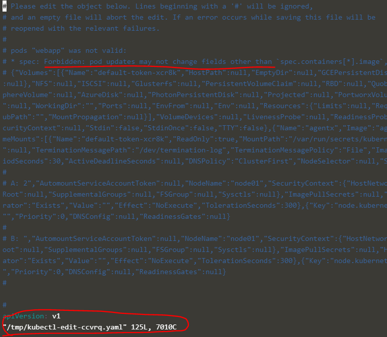
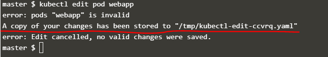
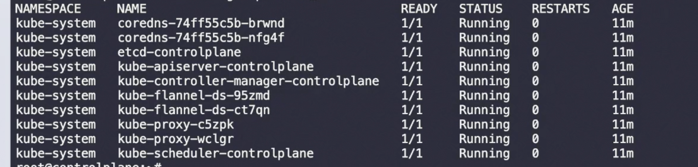
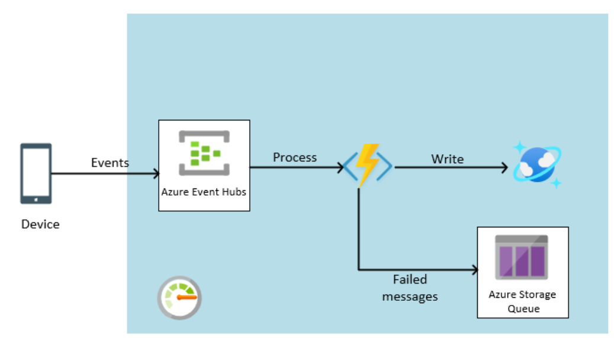

11th Dec - 
# Certified Kubernetes Adminitrator

https://www.cncf.io/certification/cka

Mode of delivery: Online
Online Proctor will be available

----
### Prerequesites

It tests your hands-on skills.

3 hours will be given. You'll be able to refer to the official K8s documentation. 

In late-2023:

With the latest version of the exam, it is now only 2 hours. The contents of this course have been updated with the changes required for the latest version of the exam.

Below are some references:

Certified Kubernetes Administrator: https://www.cncf.io/certification/cka/

Exam Curriculum (Topics): https://github.com/cncf/curriculum

Candidate Handbook: https://www.cncf.io/certification/candidate-handbook

Exam Tips: http://training.linuxfoundation.org/go//Important-Tips-CKA-CKAD

Head over to this link to enroll in the Certification Exam. Remember to keep the code – 20KODE – handy to get a 20% discount while registering for the CKA exam with Linux Foundation.

----
### Core Concepts
----

#### Cluster Architecture

ETCD - Is a database that stores data in a key-value format.

Kube-scheduler - It identifies the right node to add more containers or manage containers if the nodes resources are high.

Controller-Manager:
- Node-controllers - Takes care of nodes, responsible for adding more nodes and manage nodes.
- replica-controller - It is responsible to handle the desired number of containers are running all-times in a replicaset or replication group.

Kube-apiserver - It is the management of the K8s cluster. It responsible for orchestrating all operations between the k8s cluster and the external users. And, it exposes APIs to communicate within the components within the Master node or the worker nodes itself.

Container Runtime Engine or Container Runtime Interface
- Docker
- ContainerD
- Rocket - rkt
- Crio

These are very important to run the containers on the worker nodes and master nodes.

Kubelet - It is an agent that runs on each node in a K8s cluster. It listens for instructions from the Kube-APIServer and Kube-APIServer talks with the Kubelet to get the status of the nodes and containers. It is the captain manages containers on the nodes.

Kube-Proxy - It is a service that allows connections and network between the applications that are deployed in the worker nodes.

----

### ETCD for Beginners

##### What is ETCD?

ETCD is a reliable key-value store that is secure.

##### What is a Key-Value Store?

##### How to get statred quickly?

Download the binary, extract and run the etcd service that starts a sercice that listens on 2379(default). The default client is `etcdctl` so you can make use of it store and manage the etcd store. 

```bash
# To install `etcdctl`:

apt-get install etcd-client
```
So, now the `etcdctl` can be accessed.

For example:

```bash
$ ./etcdctl set key1 value1 -- works v2.0
$ ./etcdctl get key1 -- works v2.0
```

> ETCD Versions

v0.1. Aug 2013
v0.5 Dec 2014
v2.0 Feb 2015
v3.1 Jan 2017
     Nov 2018 0 CNCF incubation

##### How to find out ETCDCTL is configured to work with what versions?

We would need to pass the `--version` as an [option] in version 2.
```
$ ./etcdctl --version
etcdctl version: 3.3.11
API version: 2
```

> [!NOTE] With the release of version 3.4, the default API version is set to 3.

##### How to set/change ETCDCTL API version for ETCDCTL v3

We can mention the `API version` via the `environmental variable`  - `ETCDCTL_API` 
```
$ ETCDCTL_API=3 ./etcdctl version
etcdctl version: 3.3.11
API version: 3.3
```

Also, instead of mentioning it each time, we can export it to the enviroment variable for the `profile`

```
$ export ETCDCTL_API=3

then,

$ ./etcdctl version
etcdctl version: 3.3.11
API version: 3.3
```

----

### ETCD for Kubernetes

What is the role of the ETCD in the K8s?

ETCD is reponsible to journal each and every tasks and operations that are happening in the K8s cluster i.e. it records the details of the pods, nodes, configs, secrets, accounts, roles, bindings and more. Every information that is executed via the `kubectl` command is being fetched from the `ETCD` server.

##### Additional information about ETCDCTL Utility

`ETCDCTL` is the `CLI tool` used to interact with ETCD.

`ETCDCTL` can interact with `ETCD Server` using 2 API versions – `Version 2` and `Version 3`. By default it’s set to use `Version 2`. **Each version has different sets of commands.**

For example, ETCDCTL `version 2` supports the following commands:

```
$ etcdctl backup
$ etcdctl cluster-health
$ etcdctl mk
$ etcdctl mkdir
$ etcdctl set
```

Whereas the commands are different in `version 3`

```
$ etcdctl snapshot save
$ etcdctl endpoint health
$ etcdctl get
$ etcdctl put
```

To set the right version of API set the environment variable `ETCDCTL_API` command

```
$ export ETCDCTL_API=3
```

When the API version is not set, it is assumed to be set to version 2. And version 3 commands listed above don’t work. When API version is set to version 3, version 2 commands listed above don’t work.

Apart from that, you must also specify the path to certificate files so that `ETCDCTL` can authenticate to the `ETCD API Server`. The certificate files are available in the `etcd-master` at the following path. We discuss more about certificates in the security section of this course. So don’t worry if this looks complex:

```
--cacert /etc/kubernetes/pki/etcd/ca.crt
--cert /etc/kubernetes/pki/etcd/server.crt
--key /etc/kubernetes/pki/etcd/server.key
```

So for the commands, you must specify the `ETCDCTL API` version and path to `certificate` files. Below is the final form:

```
$ kubectl exec etcd-controlplane -n kube-system -- sh -c "ETCDCTL_API=3 etcdctl get / --prefix --keys-only --limit=10 --cacert /etc/kubernetes/pki/etcd/ca.crt --cert /etc/kubernetes/pki/etcd/server.crt --key /etc/kubernetes/pki/etcd/server.key"
```

> [!NOTE]
> Only when the ETCD key-value store is updated, any operations that are considered as completed or else, it is NOT.
> --advertise-client-urls https://${etcd_server}:2379 -- This is the default port that ETCD_server listens and this is important.

```
# Important command to display the keys stored in the etcd server - you would need to run this command inside the etcd-master pod

$ kubectl exec etcd-master -n kube-system etcdctl get / --prefix -keys-only

# K8s stores data in a specific directory structure, being the /root directory is `/registry`
# Example:

/registry/apiregistration.k8s.io/apiservices/v1.
/registry/apiregistration.k8s.io/apiservices/v1.apps
/registry/apiregistration.k8s.io/apiservices/v1.authentication.k8s.io

```
----

### Kube-API Server

General responsibilities of the `kube-api` server:

- Authenticate User
- Validate request
- Retrieve data from ETCD datastore
- Update ETCD
- Scheduler
- Kubelet

> [!NOTE]
> When using the `kubeadm` tool, it deploys kube-api server on our behalf and it does the heavy-lifting but, to understand how it all configured, you would need to download the binary of the `kube-apiserver` and add the configuration flags/parameters to connect to the cluster accordingly.

#### Commands that you can use to find the kube-apiserver

```
---- kubeadm setup ----
# When using `kubeadm` it deploys the kube-apiserver as a pod

$ kubectl get pods -n kube-system

To get the configurations of the kube-apiserver, we can check:

$ cat /etc/kubernetes/manifests/kube-apiserver.yaml

---- Non-kubeadm setup ----

# When deploying it from scratch using binary, where it is a non-kubeadm setup:

$ cat /etc/systemd/system/kube-apiserver.service

# Or, you can use the process command to check the parameters passed to run the kube-apiserver

$ ps -aux | grep -e "kube-apiserver"
```
----

### Kube Controller Manager

It manages various controllers in a k8s cluster and it has its own responsibilities:

- Node controllers
    * Monitoring the status of the nodes, and tries to add the nodes if they are failed.
    * Checks every `5s` with the nodes whether the node is healthy or NOT. If the node is unhealthy and does not respond to the healthcheck, then it waits for `40s` to consider the node is `unhealthy` and `unreachable`. After `5m`, the node-controller will move the pods in those that nodes to a new one i.e. create new pods in the node(s) that are healthy.

```
Node Monitor Period: 5s
Node Monitor Grace Period: 40s
Pod Eviction Timeout: 5m
```
- Replication controllers
   * Monitoring the status of the pods, and tries to maintain the desired number of pods are available within the replicaset at any time. If any pods fail, it will make sure to create a new one.

There are many-more controllers in the K8s cluster:

- Deployment-controller
- Namespace-controller
- Endpoint-controller
- Cronjob
- Job-controller
- PV-Protection-controller
- Service-Account-contoller
- Stateful-Set
- Replicaset
- Node-controller
- PV-Binder-controller
- Replication-controller and many more ...

All the above controller(s) are packaged into a single process called `Kube-controller-manager`.

#### Commands that you can use to find the kube-controller-manager

```
---- kubeadm setup ----
# When using `kubeadm` it deploys the kube-controller-manager as a pod

$ kubectl get pods -n kube-system

To get the configurations of the kube-controller-manager, we can check:

$ cat /etc/kubernetes/manifests/kube-controller-manager.yaml

---- Non-kubeadm setup ----

# When deploying it from scratch using binary, where it is a non-kubeadm setup:

$ cat /etc/systemd/system/kube-controller-manager.service

# Or, you can use the process command to check the parameters passed to run the kube-controller-manager

$ ps -aux | grep -e "kube-controller-manager"
```
----

### Kube Scheduler

Scheduler is only responsible for `DECIDING` which pods goes on which nodes and it does not deploy/create those pods in the nodes.

> Breaking down how it decides or takes decision that which nodes are the best to deploy/create a pod?

Let's take an example of a pod A, that got resource requirements of 10 CPUs and there are 4 nodes with 4 CPUs, 6 CPUs, 12 CPUs, and 16 CPUs. So, below are the methods that it follows:

- "Filter's the nodes" that got `greater than or equal` CPUs so, in this case, it will be just 2 nodes that got 12 CPUs and 16 CPUs available.
- "Ranks the nodes" that got free CPUs once the pod is deployed/created. In this scenario, there will be just 2 CPUs left in Node A and 6 CPUs left in Node B.
- Now, it decides that Node B is the best node that the pod can be deployed and informs the `Kubelet` to create/deploy the pods.

#### Commands that you can use to find the kube-scheduler

```
---- kubeadm setup ----
# When using `kubeadm` it deploys the kube-scheduler as a pod

$ kubectl get pods -n kube-system

To get the configurations of the kube-scheduler, we can check:

$ cat /etc/kubernetes/manifests/kube-scheduler.yaml

---- Non-kubeadm setup ----

# When deploying it from scratch using binary, where it is a non-kubeadm setup:

$ cat /etc/systemd/system/kube-scheduler.service

# Or, you can use the process command to check the parameters passed to run the kube-scheduler

$ ps -aux | grep -e "kube-scheduler"
```
----

### Kubelet

`Kubelet` is like a captain on the ship. There are sole point of contact of the master ship and send reports of the ship to the master. Basically, once the `kube-scheduler` decides the best node to deploy/create the pods or containers. It will pass its information to `kubelet` via `kube-apiserver`. This `kubelet` immediately gets the information from the `kube-apiserver` and informs the `container runtime` i.e. `Docker` or `containerD` to pull the images of the containers from the repository and deploy it.

> [!CAUTION]
> `kubeadm` tool does not deploy `kubelet` as a pod or create it by itself. We need to manually install & run the `kubelet` service on the worker nodes.

#### Commands that you can use to find the kubelet

```
---- kubeadm setup ----

NO Kubeadm setup

---- Supports only non-kubeadm setup ----

# When deploying it from scratch using binary, where it is a non-kubeadm setup:

$ cat /etc/systemd/system/kubelet.service

# Or, you can use the process command to check the parameters passed to run the kubelet

$ ps -aux | grep -e "kubelet"
```
----

### Kube Proxy

pod network - weave net

`kube-proxy` runs on each node as a process and it's job is to look for new services like `clusterIP`, `NodePort`, and `LoadBalancer` as these are virtual components and everytime a new service is created, it makes sure to create IP rules so that it can forward the traffic to the backend pods within the nodes. It uses `IP-Table` rules in each node of the cluster and forwards traffic.

#### Commands that you can use to find the kube Proxy

```
---- kubeadm setup ----
# When using `kubeadm` it deploys the kube-proxy as a pod, infact this is a `daemonset`

$ kubectl get pods -n kube-system

$ kubectl get daemonset -n kube-system

To get the configurations of the kube-scheduler, we can check:

$ cat /etc/kubernetes/manifests/kube-proxy.yaml

---- Non-kubeadm setup ----

# When deploying it from scratch using binary, where it is a non-kubeadm setup:

$ cat /etc/systemd/system/kube-proxy.service

# Or, you can use the process command to check the parameters passed to run the kube-proxy

$ ps -aux | grep -e "kube-proxy"
```
----

### Pods

- What are pods?

Pods are the smallest `object` that we can create within the K8s cluster. It's basically K8s cluster(consider, it's a single node cluster) > Node > Pod > Containers. So, you create containers within the pod and scale the pods while you want to scale the containers.

To create a pod from the command line, use the command:

Create an NGINX Pod

kubectl run nginx --image=nginx

As of version 1.18, kubectl run (without any arguments such as --generator ) will create a pod instead of a deployment.

To create a deployment using imperative command, use kubectl create:

kubectl create deployment nginx --image=nginx

Kubernetes Concepts – https://kubernetes.io/docs/concepts/

Pod Overview- https://kubernetes.io/docs/concepts/workloads/pods/pod-overview/

#### YAML and how to construct it?

Starting with key-value pairs:

```
# All key-values pair(s) have space after the colon.
fruit: apple
liquid: water
gas: oxygen
number: one
```

Arrays

```
fruits:
-  apple
-  mango
-  orange
-  banana
```
So, all items in the array should follow the `-` hyphen in front and with equal number of spaces. Note, it is not restricted to have a only 2 or 3 spaces after hyphen but to keep it legible and need, 2 or 3 should work.


Dictionaries/Map

```
fruit:
   - - - - - - - - - - -
- | Banana:             |
  |   calories: 100g    |
  |   fat: 20g          |   <----- Dictionaries
  |   carbs: 20g        |
- | Apple:              |
  |   calories: 200g    |
  |   fat: 2g           |
  |   carbs: 100g       |
   - - - - - - - - - - -
```

So, dictionaries are the properties of the `object` where in the above example, the object is banana and its properties are calories, fat, carbs. So, for dictionaries, you would need to give the key and place the objects below with a space.

#### Pods with YAML

Please note, when creating the pods, the K8s cluster should have `4 ROOT LEVEL properties`:

```
#pod-definition.yml

apiVersion:
kind:
metadata:
spec:
```

The above ones are the mandatory properties.

Now, let's create an example `pod-definition.yml`

```
apiVersion: v1
kind: Pod
metadata:
  name: app-dev
  labels: 
    type: front-end
    app: development
spec:
  containers:
    - name: nginx-container
      image: nginx
```

Use the below command to create the pod in the K8s cluster:

```
kubectl create -f pod-definition.yml
```

Use the below command to get the pods:

```
kubectl get pods
```

And,

```
kubectl describe pod <pod_name>
```


Also, you can make use of the commands to quickly perform a dry-run.

```
kubectl run nginx --image=nginx --dry-run=client -o yaml 

# Response/Output

apiVersion: v1
kind: Pod
metadata:
  creationTimestamp: null
  labels:
    run: nginx
  name: nginx
spec:
  containers:
  - image: nginx
    name: nginx
    resources: {}
  dnsPolicy: ClusterFirst
  restartPolicy: Always
status: {}

We can save its output to a YAML file and can rerun it quickly like
kubectl run nginx --image=nginx --dry-run=client -o yaml >> output.yaml
```
---

### Replication Controller

Replication controllers allows us to run multiple instances of single pod in the cluster.

There are two terms:
[1] Replication Controller - Older terminology
[2] Replica Set - Latest

Major difference between [1] and [2] is the:

```
selector:
  matchLabels:
    type: front-end
```

The `selectors` are NOT mandatory for the replication controllers but, it is mandatory for the replicasets.

#### Scaling of Replicas

Commands used here:
```
$ kubectl create -f replicaset-definition.yaml

$ kubectl get replicaset

$ kubectl delete <replicaset_name>     ----> This deletes all the pods underlying the replicasets

$ kubectl replace -f replicaset-definition.yml     ---> This command will delete the pod and recreate it instead of we deleting once and creating it again.

$ kubectl scale --replicas=6 -f replicaset.yml
```

Below is the replicaset and replication controller yaml definition file:

```
# Replication Controller

apiVersion: v1
kind: ReplicationController
metadata:
  name: app-rc
  labels: 
    type: replication_controller
spec:
  template:
    metadata:
      name: app-dev
      labels: 
        type: front-end
        app: development
    spec:
      containers:
        - name: nginx-container
          image: nginx
  replicas: 3

# Response/Output:

% kubectl get pods                                        
NAME                   READY   STATUS              RESTARTS   AGE
app-rc-9gbgl           0/1     ContainerCreating   0          3s
app-rc-dlb6z           0/1     ContainerCreating   0          3s
app-rc-mcv78           0/1     ContainerCreating   0          3s
app-replicaset-cjfmx   1/1     Running             0          113s
app-replicaset-fmzn6   1/1     Running             0          113s
app-replicaset-j99z5   1/1     Running             0          113s

% kubectl get pods
NAME                   READY   STATUS              RESTARTS   AGE
app-rc-9gbgl           0/1     ContainerCreating   0          6s
app-rc-dlb6z           1/1     Running             0          6s
app-rc-mcv78           1/1     Running             0          6s
app-replicaset-cjfmx   1/1     Running             0          116s
app-replicaset-fmzn6   1/1     Running             0          116s
app-replicaset-j99z5   1/1     Running             0          116s

% kubectl get pods
NAME                   READY   STATUS    RESTARTS   AGE
app-rc-9gbgl           1/1     Running   0          9s
app-rc-dlb6z           1/1     Running   0          9s
app-rc-mcv78           1/1     Running   0          9s
app-replicaset-cjfmx   1/1     Running   0          119s
app-replicaset-fmzn6   1/1     Running   0          119s
app-replicaset-j99z5   1/1     Running   0          119s
```


```
# Replicaset definition file

apiVersion: apps/v1
kind: ReplicaSet
metadata:
  name: app-replicaset
  labels: 
    type: replication_set
spec:
  template:
    metadata:
      name: app-dev
      labels: 
        type: front-end
        app: development
    spec:
      containers:
        - name: nginx-container
          image: nginx
  replicas: 3
  selector:
    matchLabels:
      type: front-end

# Response/Output:

% kubectl get pods
NAME                   READY   STATUS              RESTARTS   AGE
app-replicaset-cjfmx   1/1     Running             0          6s
app-replicaset-fmzn6   0/1     ContainerCreating   0          6s
app-replicaset-j99z5   0/1     ContainerCreating   0          6s

% kubectl get pods
NAME                   READY   STATUS    RESTARTS   AGE
app-replicaset-cjfmx   1/1     Running   0          10s
app-replicaset-fmzn6   1/1     Running   0          10s
app-replicaset-j99z5   1/1     Running   0          10s
```

#### After Scaling:

```bash
% kubectl scale --replicas=6 -f replicaset-definition.yaml 
replicaset.apps/app-replicaset scaled

% kubectl get pods                                        
NAME                   READY   STATUS              RESTARTS   AGE
app-rc-9gbgl           1/1     Running             0          86s
app-rc-dlb6z           1/1     Running             0          86s
app-rc-mcv78           1/1     Running             0          86s
app-replicaset-82b88   0/1     ContainerCreating   0          3s
app-replicaset-b8djw   0/1     ContainerCreating   0          3s
app-replicaset-cjfmx   1/1     Running             0          3m16s
app-replicaset-d6tcb   1/1     Running             0          3s
app-replicaset-fmzn6   1/1     Running             0          3m16s
app-replicaset-j99z5   1/1     Running             0          3m16s

% kubectl get pods
NAME                   READY   STATUS    RESTARTS   AGE
app-rc-9gbgl           1/1     Running   0          95s
app-rc-dlb6z           1/1     Running   0          95s
app-rc-mcv78           1/1     Running   0          95s
app-replicaset-82b88   1/1     Running   0          12s
app-replicaset-b8djw   1/1     Running   0          12s
app-replicaset-cjfmx   1/1     Running   0          3m25s
app-replicaset-d6tcb   1/1     Running   0          12s
app-replicaset-fmzn6   1/1     Running   0          3m25s
app-replicaset-j99z5   1/1     Running   0          3m25s
```

#### Delete replicaset

```bash
% kubectl get replicaset 
NAME             DESIRED   CURRENT   READY   AGE
app-replicaset   6         6         6       5m8s

% kubectl delete replicaset app-replicaset
replicaset.apps "app-replicaset" deleted

% kubectl get pods                        
NAME           READY   STATUS    RESTARTS   AGE
app-rc-9gbgl   1/1     Running   0          3m57s
app-rc-dlb6z   1/1     Running   0          3m57s
app-rc-mcv78   1/1     Running   0          3m57s

% kubectl get replicaset                  
No resources found in default namespace.
```

As we mentioned above, deleting the `replicaset` will also delete the pods as you in the above output.

#### Delete Replication Controller

```bash
% kubectl get replicationcontroller
NAME     DESIRED   CURRENT   READY   AGE
app-rc   3         3         3       9m27s

% kubectl delete replicacontroller app-rc
error: the server doesn't have a resource type "replicacontroller"

% kubectl delete replicationcontroller app-rc
replicationcontroller "app-rc" deleted

% kubectl get pods
No resources found in default namespace.
```

Now, we created pods via the `replicaset` and `replicationcontroller` and deleted them.

#### Additional Commands:

```bash

$ kubectl get pods - Lists all pods in the namespace.  
$ kubectl get replicaset - Lists all ReplicaSets in the namespace.  
$ kubectl describe replicaset <replica-set-name> - Shows details of a specific ReplicaSet.  
$ kubectl describe pod <pod-name> - Displays detailed information about a pod.  
$ kubectl delete pod <pod-name> - Deletes a specific pod.  
$ kubectl create -f <replicaset-definition-file>.yaml - Creates a ReplicaSet from a YAML file.  
$ kubectl delete replicaset <replica-set-name> - Deletes a specific ReplicaSet.  
$ kubectl edit replicaset <replica-set-name> - Modifies a ReplicaSet in real-time.  
$ kubectl delete pods <pod-name-pattern> - Deletes pods matching a pattern.  
$ kubectl scale replicaset <replica-set-name> --replicas=<number> - Scales the ReplicaSet to a specified number of replicas.  

# Then, to delete all the pod in one go:

$ kubectl delete pods --all
$ kubectl delete pods -l <label-key>=<label-value>
$ kubectl delete pods --all -n <namespace>

# Important, when in doubt, you can use:


$ kubectl explain replicaset
$ kubectl explain replicationcontroller
$ kubectl explain pod

So, the above explain command will give us the details of what to use.

# shorthand:

$ kubectl get rs - For replicasets
$ kubectl get deploy - For deployments
```

---

### Deployments

```bash
$ kubectl create -f deployment-definition.yaml
deployment.apps/app-deployment created
```
```bash
$ kubectl get all 

NAME                                  READY   STATUS    RESTARTS   AGE
pod/app-deployment-85489cdd5b-7294b   1/1     Running   0          14s
pod/app-deployment-85489cdd5b-926jt   1/1     Running   0          14s
pod/app-deployment-85489cdd5b-wjq2b   1/1     Running   0          14s

NAME                 TYPE        CLUSTER-IP   EXTERNAL-IP   PORT(S)   AGE
service/kubernetes   ClusterIP   10.96.0.1    <none>        443/TCP   44d

NAME                             READY   UP-TO-DATE   AVAILABLE   AGE
deployment.apps/app-deployment   3/3     3            3           14s

NAME                                        DESIRED   CURRENT   READY   AGE
replicaset.apps/app-deployment-85489cdd5b   3         3         3       14s
```
The deployment definition file, will automatically create the replicaset and the pods.

```yaml
# deployment-definition.yaml
apiVersion: apps/v1
kind: Deployment
metadata: 
  name: app-deployment
spec:
  template:
    metadata:
      name: pod-nginx
      labels:
        type: frontend
    spec:
      containers:
        - name: nginx
          image: nginx
  replicas: 3
  selector:
    matchLabels:
      type: frontend
```

```bash
# This explain command will be very handy:
$ kubectl explain deployments

GROUP:      apps
KIND:       Deployment
VERSION:    v1

DESCRIPTION:
    Deployment enables declarative updates for Pods and ReplicaSets.
    
FIELDS:
  apiVersion    <string>
    APIVersion defines the versioned schema of this representation of an object.
    Servers should convert recognized schemas to the latest internal value, and
    may reject unrecognized values. More info:
    https://git.k8s.io/community/contributors/devel/sig-architecture/api-conventions.md#resources

  kind  <string>
    Kind is a string value representing the REST resource this object
    represents. Servers may infer this from the endpoint the client submits
    requests to. Cannot be updated. In CamelCase. More info:
    https://git.k8s.io/community/contributors/devel/sig-architecture/api-conventions.md#types-kinds

  metadata      <ObjectMeta>
    Standard object's metadata. More info:
    https://git.k8s.io/community/contributors/devel/sig-architecture/api-conventions.md#metadata

  spec  <DeploymentSpec>
    Specification of the desired behavior of the Deployment.

  status        <DeploymentStatus>
    Most recently observed status of the Deployment.
```


#### Deployment Updates, Rollout, and Versioning

Commands you to run Rollout strategy: 
[1] Rolling update 
[2] Recreate

```bash
$ kubectl create -f deployment-definition.yml
$ kubectl get deployments
$ kubectl apply -f deployment-definition.yml
$ kubectl set image deployment/myapp-deployment nginx=nginx:1.9.1
$ kubectl rollout status deployment/myapp-deployment
$ kubectl rollout history deployment/myapp-deployment
$ kubectl rollout undo deployment/myapp-deployment
$ kubectl create -f deployment-definition.yml --record=true
```

```bash
$ kubectl get pods -o wide

NAME                                    READY   STATUS    RESTARTS      AGE   IP            NODE       NOMINATED NODE   READINESS GATES
app-deployment-nginx-69976db885-5wn4v   1/1     Running   0             13m   10.244.0.34   minikube   <none>           <none>
app-deployment-nginx-69976db885-7q9qx   1/1     Running   0             13m   10.244.0.36   minikube   <none>           <none>
app-deployment-nginx-69976db885-xv58d   1/1     Running   0             13m   10.244.0.35   minikube   <none>           <none>
hello-node-7b4b746b66-9cr8x             1/1     Running   3 (12h ago)   45d   10.244.0.23   minikube   <none>           <none>

$ kubectl get all -o wide 

NAME                                        READY   STATUS    RESTARTS      AGE   IP            NODE       NOMINATED NODE   READINESS GATES
pod/app-deployment-nginx-69976db885-5wn4v   1/1     Running   0             13m   10.244.0.34   minikube   <none>           <none>
pod/app-deployment-nginx-69976db885-7q9qx   1/1     Running   0             13m   10.244.0.36   minikube   <none>           <none>
pod/app-deployment-nginx-69976db885-xv58d   1/1     Running   0             13m   10.244.0.35   minikube   <none>           <none>
pod/hello-node-7b4b746b66-9cr8x             1/1     Running   3 (12h ago)   45d   10.244.0.23   minikube   <none>           <none>

NAME                                  TYPE           CLUSTER-IP       EXTERNAL-IP   PORT(S)          AGE   SELECTOR
service/hello-node                    LoadBalancer   10.103.22.214    <pending>     8080:31963/TCP   45d   k8s-app=hello-node
service/kubernetes                    ClusterIP      10.96.0.1        <none>        443/TCP          45d   <none>

NAME                                   READY   UP-TO-DATE   AVAILABLE   AGE   CONTAINERS        IMAGES                                         SELECTOR
deployment.apps/app-deployment-nginx   3/3     3            3           13m   nginx-container   nginx                                          type=frontend
deployment.apps/hello-node             1/1     1            1           45d   hello-node        registry.k8s.io/e2e-test-images/agnhost:2.39   k8s-app=hello-node

NAME                                              DESIRED   CURRENT   READY   AGE   CONTAINERS        IMAGES                                         SELECTOR
replicaset.apps/app-deployment-nginx-69976db885   3         3         3       13m   nginx-container   nginx                                          pod-template-hash=69976db885,type=frontend
replicaset.apps/hello-node-7b4b746b66             1         1         1       45d   hello-node        registry.k8s.io/e2e-test-images/agnhost:2.39   k8s-app=hello-node,pod-template-hash=7b4b746b66


$ kubectl edit deployment app-deployment-nginx
deployment.apps/app-deployment-nginx edited

$ kubectl rollout status deployment app-deployment-nginx
deployment "app-deployment-nginx" successfully rolled out

$ kubectl rollout history deployment app-deployment-nginx
deployment.apps/app-deployment-nginx 
REVISION  CHANGE-CAUSE
1         <none>

$ kubectl get all -o wide

NAME                                        READY   STATUS    RESTARTS      AGE   IP            NODE       NOMINATED NODE   READINESS GATES
pod/app-deployment-nginx-69976db885-5wn4v   1/1     Running   0             18m   10.244.0.34   minikube   <none>           <none>
pod/app-deployment-nginx-69976db885-7q9qx   1/1     Running   0             18m   10.244.0.36   minikube   <none>           <none>
pod/app-deployment-nginx-69976db885-xv58d   1/1     Running   0             18m   10.244.0.35   minikube   <none>           <none>
pod/hello-node-7b4b746b66-9cr8x             1/1     Running   3 (12h ago)   45d   10.244.0.23   minikube   <none>           <none>

NAME                                  TYPE           CLUSTER-IP       EXTERNAL-IP   PORT(S)          AGE   SELECTOR
service/hello-node                    LoadBalancer   10.103.22.214    <pending>     8080:31963/TCP   45d   k8s-app=hello-node
service/kubernetes                    ClusterIP      10.96.0.1        <none>        443/TCP          45d   <none>

NAME                                   READY   UP-TO-DATE   AVAILABLE   AGE   CONTAINERS        IMAGES                                         SELECTOR
deployment.apps/app-deployment-nginx   3/3     3            3           18m   nginx-container   nginx                                          type=frontend
deployment.apps/hello-node             1/1     1            1           45d   hello-node        registry.k8s.io/e2e-test-images/agnhost:2.39   k8s-app=hello-node

NAME                                              DESIRED   CURRENT   READY   AGE   CONTAINERS        IMAGES                                         SELECTOR
replicaset.apps/app-deployment-nginx-69976db885   3         3         3       18m   nginx-container   nginx                                          pod-template-hash=69976db885,type=frontend
replicaset.apps/hello-node-7b4b746b66             1         1         1       45d   hello-node        registry.k8s.io/e2e-test-images/agnhost:2.39   k8s-app=hello-node,pod-template-hash=7b4b746b66

----- ERROR -----

$ kubectl set image deployment nginx-container=nginx:1.18
error: resource(s) were provided, but no name was specified

----- ERROR -----

$ kubectl set image deployment app-deployment-nginx nginx-container=nginx:1.18
deployment.apps/app-deployment-nginx image updated

$ kubectl rollout status deployment app-deployment-nginx  
Waiting for deployment "app-deployment-nginx" rollout to finish: 0 of 3 updated replicas are available...
Waiting for deployment "app-deployment-nginx" rollout to finish: 1 of 3 updated replicas are available...
Waiting for deployment "app-deployment-nginx" rollout to finish: 2 of 3 updated replicas are available...
deployment "app-deployment-nginx" successfully rolled out

$ kubectl get all -o wide 

NAME                                        READY   STATUS    RESTARTS      AGE   IP            NODE       NOMINATED NODE   READINESS GATES
pod/app-deployment-nginx-7554f76c4c-6st79   1/1     Running   0             37s   10.244.0.42   minikube   <none>           <none>
pod/app-deployment-nginx-7554f76c4c-gs9cn   1/1     Running   0             37s   10.244.0.40   minikube   <none>           <none>
pod/app-deployment-nginx-7554f76c4c-pnchj   1/1     Running   0             37s   10.244.0.41   minikube   <none>           <none>
pod/hello-node-7b4b746b66-9cr8x             1/1     Running   3 (12h ago)   45d   10.244.0.23   minikube   <none>           <none>

NAME                                  TYPE           CLUSTER-IP       EXTERNAL-IP   PORT(S)          AGE   SELECTOR
service/hello-node                    LoadBalancer   10.103.22.214    <pending>     8080:31963/TCP   45d   k8s-app=hello-node
service/kubernetes                    ClusterIP      10.96.0.1        <none>        443/TCP          45d   <none>

NAME                                   READY   UP-TO-DATE   AVAILABLE   AGE   CONTAINERS        IMAGES                                         SELECTOR
deployment.apps/app-deployment-nginx   3/3     3            3           20m   nginx-container   nginx:1.18                                     type=frontend
deployment.apps/hello-node             1/1     1            1           45d   hello-node        registry.k8s.io/e2e-test-images/agnhost:2.39   k8s-app=hello-node

NAME                                              DESIRED   CURRENT   READY   AGE   CONTAINERS        IMAGES                                         SELECTOR
replicaset.apps/app-deployment-nginx-69976db885   0         0         0       20m   nginx-container   nginx                                          pod-template-hash=69976db885,type=frontend
replicaset.apps/app-deployment-nginx-7554f76c4c   3         3         3       37s   nginx-container   nginx:1.18                                     pod-template-hash=7554f76c4c,type=frontend
replicaset.apps/hello-node-7b4b746b66             1         1         1       45d   hello-node        registry.k8s.io/e2e-test-images/agnhost:2.39   k8s-app=hello-node,pod-template-hash=7b4b746b66


$ kubectl rollout undo deployment app-deployment-nginx
deployment.apps/app-deployment-nginx rolled back

$ kubectl get all -o wide 

NAME                                        READY   STATUS              RESTARTS      AGE   IP            NODE       NOMINATED NODE   READINESS GATES
pod/app-deployment-nginx-69976db885-8qzx9   0/1     ContainerCreating   0             3s    <none>        minikube   <none>           <none>
pod/app-deployment-nginx-69976db885-fsp52   0/1     ContainerCreating   0             3s    <none>        minikube   <none>           <none>
pod/app-deployment-nginx-69976db885-jpc65   0/1     ContainerCreating   0             3s    <none>        minikube   <none>           <none>
pod/hello-node-7b4b746b66-9cr8x             1/1     Running             3 (12h ago)   45d   10.244.0.23   minikube   <none>           <none>

NAME                                  TYPE           CLUSTER-IP       EXTERNAL-IP   PORT(S)          AGE   SELECTOR
service/hello-node                    LoadBalancer   10.103.22.214    <pending>     8080:31963/TCP   45d   k8s-app=hello-node
service/kubernetes                    ClusterIP      10.96.0.1        <none>        443/TCP          45d   <none>

NAME                                   READY   UP-TO-DATE   AVAILABLE   AGE   CONTAINERS        IMAGES                                         SELECTOR
deployment.apps/app-deployment-nginx   0/3     3            0           20m   nginx-container   nginx                                          type=frontend
deployment.apps/hello-node             1/1     1            1           45d   hello-node        registry.k8s.io/e2e-test-images/agnhost:2.39   k8s-app=hello-node

NAME                                              DESIRED   CURRENT   READY   AGE   CONTAINERS        IMAGES                                         SELECTOR
replicaset.apps/app-deployment-nginx-69976db885   3         3         0       20m   nginx-container   nginx                                          pod-template-hash=69976db885,type=frontend
replicaset.apps/app-deployment-nginx-7554f76c4c   0         0         0       64s   nginx-container   nginx:1.18                                     pod-template-hash=7554f76c4c,type=frontend
replicaset.apps/hello-node-7b4b746b66             1         1         1       45d   hello-node        registry.k8s.io/e2e-test-images/agnhost:2.39   k8s-app=hello-node,pod-template-hash=7b4b746b66


$ kubectl get all -o wide

NAME                                        READY   STATUS              RESTARTS      AGE   IP            NODE       NOMINATED NODE   READINESS GATES
pod/app-deployment-nginx-69976db885-8qzx9   0/1     ContainerCreating   0             9s    <none>        minikube   <none>           <none>
pod/app-deployment-nginx-69976db885-fsp52   1/1     Running             0             9s    10.244.0.44   minikube   <none>           <none>
pod/app-deployment-nginx-69976db885-jpc65   1/1     Running             0             9s    10.244.0.43   minikube   <none>           <none>
pod/hello-node-7b4b746b66-9cr8x             1/1     Running             3 (12h ago)   45d   10.244.0.23   minikube   <none>           <none>

NAME                                  TYPE           CLUSTER-IP       EXTERNAL-IP   PORT(S)          AGE   SELECTOR
service/hello-node                    LoadBalancer   10.103.22.214    <pending>     8080:31963/TCP   45d   k8s-app=hello-node
service/kubernetes                    ClusterIP      10.96.0.1        <none>        443/TCP          45d   <none>

NAME                                   READY   UP-TO-DATE   AVAILABLE   AGE   CONTAINERS        IMAGES                                         SELECTOR
deployment.apps/app-deployment-nginx   2/3     3            2           20m   nginx-container   nginx                                          type=frontend
deployment.apps/hello-node             1/1     1            1           45d   hello-node        registry.k8s.io/e2e-test-images/agnhost:2.39   k8s-app=hello-node

NAME                                              DESIRED   CURRENT   READY   AGE   CONTAINERS        IMAGES                                         SELECTOR
replicaset.apps/app-deployment-nginx-69976db885   3         3         2       20m   nginx-container   nginx                                          pod-template-hash=69976db885,type=frontend
replicaset.apps/app-deployment-nginx-7554f76c4c   0         0         0       70s   nginx-container   nginx:1.18                                     pod-template-hash=7554f76c4c,type=frontend
replicaset.apps/hello-node-7b4b746b66             1         1         1       45d   hello-node        registry.k8s.io/e2e-test-images/agnhost:2.39   k8s-app=hello-node,pod-template-hash=7b4b746b66


$ kubectl get all -o wide

NAME                                        READY   STATUS    RESTARTS      AGE   IP            NODE       NOMINATED NODE   READINESS GATES
pod/app-deployment-nginx-69976db885-8qzx9   1/1     Running   0             11s   10.244.0.45   minikube   <none>           <none>
pod/app-deployment-nginx-69976db885-fsp52   1/1     Running   0             11s   10.244.0.44   minikube   <none>           <none>
pod/app-deployment-nginx-69976db885-jpc65   1/1     Running   0             11s   10.244.0.43   minikube   <none>           <none>
pod/hello-node-7b4b746b66-9cr8x             1/1     Running   3 (12h ago)   45d   10.244.0.23   minikube   <none>           <none>

NAME                                  TYPE           CLUSTER-IP       EXTERNAL-IP   PORT(S)          AGE   SELECTOR
service/hello-node                    LoadBalancer   10.103.22.214    <pending>     8080:31963/TCP   45d   k8s-app=hello-node
service/kubernetes                    ClusterIP      10.96.0.1        <none>        443/TCP          45d   <none>

NAME                                   READY   UP-TO-DATE   AVAILABLE   AGE   CONTAINERS        IMAGES                                         SELECTOR
deployment.apps/app-deployment-nginx   3/3     3            3           20m   nginx-container   nginx                                          type=frontend
deployment.apps/hello-node             1/1     1            1           45d   hello-node        registry.k8s.io/e2e-test-images/agnhost:2.39   k8s-app=hello-node

NAME                                              DESIRED   CURRENT   READY   AGE   CONTAINERS        IMAGES                                         SELECTOR
replicaset.apps/app-deployment-nginx-69976db885   3         3         3       20m   nginx-container   nginx                                          pod-template-hash=69976db885,type=frontend
replicaset.apps/app-deployment-nginx-7554f76c4c   0         0         0       72s   nginx-container   nginx:1.18                                     pod-template-hash=7554f76c4c,type=frontend
replicaset.apps/hello-node-7b4b746b66             1         1         1       45d   hello-node        registry.k8s.io/e2e-test-images/agnhost:2.39   k8s-app=hello-node,pod-template-hash=7b4b746b66


$ kubectl get all -o wide

NAME                                        READY   STATUS    RESTARTS      AGE   IP            NODE       NOMINATED NODE   READINESS GATES
pod/app-deployment-nginx-69976db885-8qzx9   1/1     Running   0             14s   10.244.0.45   minikube   <none>           <none>
pod/app-deployment-nginx-69976db885-fsp52   1/1     Running   0             14s   10.244.0.44   minikube   <none>           <none>
pod/app-deployment-nginx-69976db885-jpc65   1/1     Running   0             14s   10.244.0.43   minikube   <none>           <none>
pod/hello-node-7b4b746b66-9cr8x             1/1     Running   3 (12h ago)   45d   10.244.0.23   minikube   <none>           <none>

NAME                                  TYPE           CLUSTER-IP       EXTERNAL-IP   PORT(S)          AGE   SELECTOR
service/hello-node                    LoadBalancer   10.103.22.214    <pending>     8080:31963/TCP   45d   k8s-app=hello-node
service/kubernetes                    ClusterIP      10.96.0.1        <none>        443/TCP          45d   <none>

NAME                                   READY   UP-TO-DATE   AVAILABLE   AGE   CONTAINERS        IMAGES                                         SELECTOR
deployment.apps/app-deployment-nginx   3/3     3            3           20m   nginx-container   nginx                                          type=frontend
deployment.apps/hello-node             1/1     1            1           45d   hello-node        registry.k8s.io/e2e-test-images/agnhost:2.39   k8s-app=hello-node

NAME                                              DESIRED   CURRENT   READY   AGE   CONTAINERS        IMAGES                                         SELECTOR
replicaset.apps/app-deployment-nginx-69976db885   3         3         3       20m   nginx-container   nginx                                          pod-template-hash=69976db885,type=frontend
replicaset.apps/app-deployment-nginx-7554f76c4c   0         0         0       75s   nginx-container   nginx:1.18                                     pod-template-hash=7554f76c4c,type=frontend
replicaset.apps/hello-node-7b4b746b66             1         1         1       45d   hello-node        registry.k8s.io/e2e-test-images/agnhost:2.39   k8s-app=hello-node,pod-template-hash=7b4b746b66

```

---
## :rotating_light: Certification Tip:

Here’s a tip!

As you might have seen already, creating and editing YAML files is a bit difficult, especially in the CLI. During the exam, you might find it difficult to copy and paste YAML files from the browser to the terminal. Using the kubectl run command can help in generating a YAML template. And sometimes, you can even get away with just the kubectl run command without having to create a YAML file at all. For example, if you were asked to create a pod or deployment with a specific name and image, you can simply run the kubectl run command.

Use the below set of commands and try the previous practice tests again, but this time, try to use the below commands instead of YAML files. Try to use these as much as you can going forward in all exercises.

Reference (Bookmark this page for the exam. It will be very handy):

https://kubernetes.io/docs/reference/kubectl/conventions/

Create an NGINX Pod

```
$ kubectl run nginx --image=nginx
```

Generate POD Manifest YAML file (-o yaml). Don’t create it(–dry-run)

```
$ kubectl run nginx --image=nginx --dry-run=client -o yaml
```

Create a deployment

```
$ kubectl create deployment --image=nginx nginx
```

Generate Deployment YAML file (-o yaml). Don’t create it(–dry-run)

```
$ kubectl create deployment --image=nginx nginx --dry-run=client -o yaml
```

Generate Deployment YAML file (-o yaml). Don’t create it(–dry-run) and save it to a file.

```
$ kubectl create deployment --image=nginx nginx --dry-run=client -o yaml > nginx-deployment.yaml
```

Make necessary changes to the file (for example, adding more replicas) and then create the deployment.

```
$ kubectl create -f nginx-deployment.yaml
```
OR

In k8s version 1.19+, we can specify the –replicas option to create a deployment with 4 replicas.

```
$ kubectl create deployment --image=nginx nginx --replicas=4 --dry-run=client -o yaml > nginx-deployment.yaml
```

----

### Services

[1] Services enable connectivity with the internal components and external components.
[2] Services can work with the applications internally.

There are three different types of Services:

- NodePort - Range - 30000 to 32767 
- ClusterIP
- LoadBalancer

#### NodePort Service

```bash
+-----------------------------------------------------------+
|                       K8s Architecture                    |
+-----------------------------------------------------------+
|                          Minikube                         |
|-----------------------------------------------------------|
| +-----------------------------------------------------+   |
| |                 Minikube VM                         |   |
| |-----------------------------------------------------|   |
| | Node IP: 192.168.49.2                               |   |
| | Pod CIDR: 10.244.0.0/24                             |   |
| |                                                     |   |
| |                                                     |   |
| |                                                     |   |
| |                                                     |   |
| |      | Port 30007  |                                |   |
| | +--------------------+                              |   |
| | | NodePort Service   |                              |   |
| | | IP: 10.244.0.43    |                              |   |
| | | app-deployment-nginx                              |   |
| | +--------------------+                              |   | 
| |       | Port 80  |                                  |   |
| |         |      |                                    |   |
| |         |      |                                    |   |
| |         |      |                                    |   |
| |         |      |                                    |   | 
| |       | Port 80  |                                  |   |
| | +--------------------+   +-----------------------+  |   |
| | | Pod A              |   | Pod B                 |  |   |
| | | IP: 10.244.0.43    |   | IP: 10.244.0.44       |  |   |
| | | app-deployment-nginx   |                       |  |   |
| | +--------------------+   +-----------------------+  |   |
| | +--------------------+   +-----------------------+  |   |
| | | Pod C              |   | Pod D                 |  |   |
| | | IP: 10.244.0.45    |   | IP: 10.244.0.23       |  |   |
| | |                    |   | hello-node            |  |   |
| | +--------------------+   +-----------------------+  |   |
| |                              | Port 3232  |         |   |
| |                                                     |   |
| +-----------------------------------------------------+   |
|                                                           |
+-----------------------------------------------------------+
```

Now, when I curl from outside the VM i.e. from the internet, I should be able to get access to the pods/containers/applications inside the pods. In this scenario, it is `NGINX` application within the pods A, B, and C.

> [!NOTE]  
> When I try to access the website URL: `192.168.49.2:30007`, I should be able to reach the nginx pod exposed via the `service port 80`.
> Also, the NodePort service will automatically route the traffic between the pods within the same node or within the different nodes too. Basically, it act as a LoadBalancer and there is no need to specify or deploy it manually.

#### Example:

- Before creating the service:


```bash
$ kubectl get all -o wide   

NAME                 TYPE           CLUSTER-IP      EXTERNAL-IP   PORT(S)          AGE   SELECTOR
service/hello-node   LoadBalancer   10.103.22.214   <pending>     8080:31963/TCP   46d   k8s-app=hello-node
service/kubernetes   ClusterIP      10.96.0.1       <none>        443/TCP          46d   <none>
```

- Post creating the service using the below definition file:

```yaml
# service-definition.yaml
apiVersion: v1
kind: Service
metadata: 
  name: nginx-service
  labels:
    type: nodeport-service
spec:
  type: NodePort
  ports:
    - port: 80                   # service port that connects as a tunnel to the targetPort and the nodePort
      targetPort: 80             # nginx pod port which called as targetPort
      nodePort: 30007            # port that is in the node that gets exposed to the outside world or internet
  selector:
    app: prod-app
```

```bash
$ kubectl create -f service-definition.yaml 
service/nginx-service created
```

```bash
$ kubectl get services -o wide
NAME            TYPE           CLUSTER-IP      EXTERNAL-IP   PORT(S)          AGE    SELECTOR
hello-node      LoadBalancer   10.103.22.214   <pending>     8080:31963/TCP   46d    k8s-app=hello-node
kubernetes      ClusterIP      10.96.0.1       <none>        443/TCP          46d    <none>
nginx-service   NodePort       10.102.73.198   <none>        80:30007/TCP     2m5s   app=prod-app
```

You can also use `minikube service <service-name> --url` to get the URL that you can connect.

#### ClusterIP Service & LoadBalancer Service

- ClusterIP connects the internal pods and does not have any exposed ports to the internet.

- LoadBalancer, it is basically the `NodePort` but it works well when using in the `GCP`, `AWS`, and `Azure` environment where it deploys the `LoadBalancer` in between the pods and the node(s).

```yaml
# clusterip-service-definition.yaml
apiVersion: v1
kind: Service
metadata: 
  name: nginx-service
  labels:
    type: clusterIP-service
spec:
  type: ClusterIP
  ports:
    - port: 80
      targetPort: 80
  selector:
    app: prod-app
```
```yaml
# loadbalancer-service-definition.yaml
apiVersion: v1
kind: Service
metadata: 
  name: nginx-service
  labels:
    type: nodeport-service
spec:
  type: LoadBalancer
  ports:
    - port: 80
      targetPort: 80
      nodePort: 30007
  selector:
    app: prod-app
```
when created the `service`, you can check the complete details using the `describe` service command:

```bash
kubectl describe service <service_name>

OR

kubectl describe svc <service_name>
```

> [!NOTE]
> Make use of the imperative commands i.e. the shortcut commands used in K8s from the [kubernetes official documentation](https://kubernetes.io/docs/tasks/manage-kubernetes-objects/imperative-command/).


----

### Namespaces

There are three important namespaces:

- kube-system (where, the k8s components are isolated)
- default
- kube-public (this is where the resources made available to the users)

Namespaces are mostly used in the `dev` and `prod` environments.

Each of the namespaces can have the own `resource-limits` and `policies` so that you can instruct them to do what.

To create namespace:

```yaml
# namespace-dev.yaml
apiVersion: v1
kind: Namespace
metadata:
    name: dev   
```

Followed by:

```bash
$ kubectl create -f namespace-dev.yaml
```

Or, using the `implicit` commands:

```bash
$ kubectl create namespace dev
```

#### Additional namespace commands:

```bash
# Get pods from a specific namespace
$ kubectl get pods --namespace=dev

# Get pods from the default namespace
$ kubectl get pods 

# To set a specific namespace permanently instead of default namespace
$ kubectl config set-context $(kubetl config current-context) --namespace=dev

# To get the pods in all namespaces
$ kubectl get pods --all-namespaces
```

#### How to Add Resource Limits to the Namespaces

```yaml
# compute-quota.yaml

apiVersion: v1
kind: ResourceQuota
metadata: 
    name: compute-quota
    namespace: dev
spec:
    hard:
        pods: "10"
        requests.cpu: "4"
        requests.memory: 5Gi
        limits.cpu: "10"
        limits.memory: 10Gi
```

```bash
$ kubectl create -f compute-quota.yaml
```
Get all namespaces

```bash
$ kubectl get namespaces

NAME              STATUS   AGE
default           Active   8m45s
dev               Active   30s
finance           Active   30s
kube-node-lease   Active   8m45s
kube-public       Active   8m45s
kube-system       Active   8m46s
manufacturing     Active   30s
marketing         Active   30s
prod              Active   30s
research          Active   30s
```

```bash
$ kubectl get pods --all-namespaces

OR

$ kubectl get pods -A
```

### Imperative and Declarative Commands

There are different approaches to manage IaaC - Infrastructure as a code which are classified as `Imperative` and `Declarative`.

#### Imperative Commands:
```bash
## Creating Objects
$ kubectl run --image=nginx nginx
$ kubectl create deployment --image=nginx nginx
$ kubecti expose deployment nginx --port 80

## Updating Objects
$ kubectl edit deployment nginx
$ kubectl scale deployment nginx --replicas=5
$ kubectl set image deployment nginx nginx=nginx:1.18

# Imperative Object Configuration Files
## Creating/Editing(replace)/Deleting Objects 
$ kubectl create -f nginx. yaml
$ kubectl replace -f nginx.yaml
$ kubectl delete -f nginx.yaml
```

Imperative commands are a quick commands that are limited and cannot run in complex environments.

Creating Manifests file, configuration files will give us and an other user to understand what is configured and how the containers or pods or deployments are running.

> [!IMPORTANT]
> When using the `$ kubectl edit pod nginx` will only edit the pod and the changes are `NOT RECORDED` 
> To RECORD the changes, we should use `$ kubectl replace -f nginx.yaml`, only after making changes to the `nginx.yaml` file.
> There are times when you wanted to completely delete the existing objects and create a new objects so you can use `$ kubectl replace --force -f nginx.yaml`.

It throws errors when try to perform any operations and it fails.

From an exam perspective, it makes you faster. If you wanted to `edit` a deployment, you can run it using the edit command.

#### Declarative 

Using the same configuration file, you can run the declarative way:

```bash
## Create Objects
$ kubectl apply -f nginx.yaml
```

```bash
## Update Objects
$ kubectl apply -f nginx.yaml
```

For an exam perspective, if you wanted to create a multi-pod architecture, then `Declarative` is the best way.

----
## :rotating_light: Certification Tip:

While you would be working mostly the declarative way – using definition files, imperative commands can help in getting one-time tasks done quickly, as well as generate a definition template easily. This would help save a considerable amount of time during your exams.

Before we begin, familiarize yourself with the two options that can come in handy while working with the below commands:

`--dry-run`

 By default as soon as the command is run, the resource will be created. If you simply want to test your command, use the `--dry-run=client` option. This will not create the resource; instead, it tells you whether the resource can be created and if your command is right.

`-o yaml`

 This will output the resource definition in YAML format on the screen.

Use the above two in combination to generate a resource definition file quickly that you can then modify and create resources as required instead of creating the files from scratch.

#### POD

Create an NGINX Pod
```bash
$ kubectl run nginx --image=nginx
```

Generate POD Manifest YAML file (-o yaml). Don’t create it(–dry-run)

```bash
$ kubectl run nginx --image=nginx --dry-run=client -o yaml
```

#### Deployment

Create a deployment

```bash
$ kubectl create deployment --image=nginx nginx
```

Generate Deployment YAML file (-o yaml). Don’t create it(–dry-run)

```bash
$ kubectl create deployment --image=nginx nginx --dry-run=client -o yaml
```
Generate Deployment with 4 Replicas

```bash
$ kubectl create deployment nginx --image=nginx --replicas=4
```
You can also scale a deployment using the scale command:
```bash
$ kubectl scale
```
```bash
$ kubectl scale deployment nginx--replicas=4
```
Another way to do this `is to save the YAML` definition to a file and modify

```bash
$ kubectl create deployment nginx --image=nginx --dry-run=client -o yaml > nginx-deployment.yaml
```
You can then update the YAML file with the replicas or any other field before creating the deployment.

#### Service

Create a Service named `redis-service` of type `ClusterIP` to expose pod `redis` on port `6379`
```bash
$ kubectl expose pod redis --port=6379 --name redis-service --dry-run=client -o yaml
```

**_(This will automatically use the pod’s labels as selectors)_**

Or

```bash
$ kubectl create service clusterip redis --tcp=6379:6379 --dry-run=client -o yaml 
```
**_(This will not use the pods labels as selectors, instead, it will assume selectors as app=redis. You cannot pass in selectors as an option. So, it does not work very well if your pod has a different label set. So, generate the file and modify the selectors before creating the service)_**

Create a Service named `nginx` of type `NodePort` to expose pod nginx’s port `80` on port `30080` on the nodes:

```bash
$ kubectl expose pod nginx --type=NodePort --port=80 --name=nginx-service --dry-run=client -o yaml
```
**_(This will automatically use the pod’s labels as selectors, but you cannot specify the node port. You have to generate a definition file and then add the node port manually before creating the service with the pod.)_**

Or

```bash
$ kubectl create service nodeport nginx --tcp=80:80 --node-port=30080 --dry-run=client -o yaml
```
**_(This will not use the pod labels as selectors.)_**

Both the above commands have their own challenges. While one of them cannot accept a selector, the other cannot accept a node port. I would recommend going with the

```bash
$ kubectl expose
```
command. If you need to specify a node port, generate a definition file using the same command and manually input the nodeport before creating the service.

Reference:
> Kubectl Commands: https://kubernetes.io/docs/reference/generated/kubectl/kubectl-commands
> Conventions: https://kubernetes.io/docs/reference/kubectl/conventions/

-----

### Kubectl Apply

```bash
kubectl apply -f nginx.yaml
```

There are three states for this `apply` command:

- Local file
- Live Object Configuration
- Last Applied Configuration

`Live Object configuration`, when the object is not available, it creates with the system fields.

`Last applied configuration` - it's basically to understand what fields were removed.

Here you go, refer to this documentation - [Merging changes to primitive fields 
](https://kubernetes.io/docs/tasks/manage-kubernetes-objects/declarative-config/#merging-changes-to-primitive-fields)


Where is this `Last applied configuration` stored? It is stored in the `annotions` under the `metadata` property which names `last-applied-configuration`.

From kodekloudhub: 

We have created a repository with notes, links to documentation, and answers to practice questions here. Please make sure to go through these as you progress through the course:

https://github.com/kodekloudhub/certified-kubernetes-administrator-course

----

### Scheduling Section Introduction

#### Manual Scheduling

Different way to Manually scheduling a pod on a node.


#### How scheduling works?

Usually `nodeName` field is not set in the `pod-definition.yaml`, but k8s adds it automatically. This is important to `Bind` the `pod`.

[1] The scheduler goes through all the pods and identifies all the pods where the `nodeName` parameter is NOT SET. Those are the candidates for scheduling.
[2] Once identifies those pods, it schedules the pod to a Node. By setting the `nodeName` to that pod.
[3] Basically, it is called `Binding` where, it binds the pod to a node by creating a `binding object`.


If there are `no scheduler` or if you do not want to use the `built-in scheduler` and you want allocate the pods to the nodes, then we need to manually bind the pod to the nodes.

Also, if the pods are NOT scheduled to a specific state, the pods continues to be in a `PENDING` state.

Without a scheduler, the easiest way to schedule the pod to a node is to add the `nodeName` field/parameter/property to the `pod-definition.yaml` file while creating the pod itself.

> [!Note] You cannot modify or add the `nodeName` field/parameter/property when the pod is already created.

#### What if the pod is already created and assign the pod to a NODE?

A way to create assign a node to an existing pod is to create a binding object `pod-bind-definition.yaml` and in the binding object, you point to a target node parameter called `target.kind`, `target.name`, and `target.apiVersion` and then run a post request.

Example scenario: 

An `nginx` pod is already created and we need to add a `binding object` to allocate the pod to a Node `node02`.

```yaml
# pod-definition.yaml

apiVersion: v1
kind: Pod
metadata:
    name: nginx
    labels:
        app: nginx
spec:
    containers:
        - image: nginx
          name: nginx
          ports:
            - containerPort: 80
```

```yaml
# pod-bind-definition.yaml

apiVersion: v1
kind: Binding
metadata:
    name: nginx
target:
    apiVersion: v1
    kind: Node
    name: node02
```

Now, finally run a `POST` request:

```bash
curl --header "Content-Type:application/json" --request POST --data '{"apiVersion":"v1", "kind":"Binding", ...}' http://$SERVER/api/v1/namespaces/default/pods/$PODNAME/binding/
```

> [!IMPORTANT] 
> How will you run the above `curl` command?
> basically, the `$SERVER` is `kube-proxy` so you can start the server by running `kubectl proxy` in a separate terminal so that it gives you a SERVER Endpoint
> like `127.0.0.1:8001`
> And, for `$PODNAME`, you can add it as an environmental variable or, can add the podname directly.
> Refer to this [K8s official documentation](https://kubernetes.io/docs/tutorials/kubernetes-basics/explore/explore-intro/#:~:text=new%20terminal%2C%20run%3A-,kubectl%20proxy,-Now%20again%2C%20we%27ll)
> 
> Create a `pod-binding.json` file:
> ```json
> {
>  "apiVersion": "v1",
>  "kind": "Binding",
>  "metadata": {
>    "name": "nginx"
> },
>  "target": {
>    "apiVersion": "v1",
>    "kind": "Node",
>    "name": "controlplane"
> }
> }
>
> # Please note, you would need to pass the JSON format as above and NO Flattened JSON format is accepted or recognized.
>
> ```
> In the end, the request looks like this:
> ```
> curl --header "Content-Type:application/json" --request POST --data @pod-binding.json http://127.0.0.1:8001/api/v1/namespaces/default/pods/nginx/binding/
> ```
> 
> ```json
> # Output looks like this:
> {
>   "kind": "Status",
>   "apiVersion": "v1",
>   "metadata": {},
>   "status": "Success",
>   "code": 201
> }
> ```

----

### Labels and Selectors

#### What is Labels and Selectors in General in K8s?

It is standard method to group things together i.e. pods, replicasets, services as such. It is basically filtering the specific pods in midst of 100s of pods. 

Labels are the properties that are attached to an object and the Selectors are the one that selects i.e. it filters among other objects.

To use `Selector` to filter the pods(can filter other objects too):

```bash
$ kubectl get pods --selector app=App1

$ kubectl get pods --selector env=prod,bu=finance,tier=frontend
```

> [!TIP] As there could be many pods, you can count the pods using the `wordcount` command i.e. `wc`. Also, use `--no-headers` to remove the headers.
> ```bash
> kubectl get pods --selector env=dev --no-headers | wc -l
> ```

####  Annotations

It records the details of the replicaset like the `buildversion`, `last_configured_options` and so on.

---

### Taints and Tolerations

Concepts of Taints and Tolerations

- Taints are set on Nodes
- Tolerations are set on Pods

#### How can we `Taint` a Node?

```bash
$ kubectl taint nodes node-name key=value:taint-effect
```
#### What is `taint-effect`?

It is the option that we tell the Node that `What happens to PODs that do not tolerate this taint`.

There are three options of `taint-effect`:
* NoSchedule
* PreferNoSchedule
* NoExecute

- NoExecute:
This affects pods that are already running on the node as follows:
Pods that do not tolerate the taint are evicted immediately
Pods that tolerate the taint without specifying tolerationSeconds in their toleration specification remain bound forever
Pods that tolerate the taint with a specified tolerationSeconds remain bound for the specified amount of time. After that time elapses, the node lifecycle controller evicts the Pods from the node.

- NoSchedule:
No new Pods will be scheduled on the tainted node unless they have a matching toleration. Pods currently running on the node are not evicted.

- PreferNoSchedule:
PreferNoSchedule is a "preference" or "soft" version of NoSchedule. The control plane will try to avoid placing a Pod that does not tolerate the taint on the node, but it is not guaranteed.

Please refer to this [Taint-effect in K8s documentation](https://kubernetes.io/docs/concepts/scheduling-eviction/taint-and-toleration/#:~:text=The%20allowed%20values,is%20not%20guaranteed.)

```bash
$ kubectl taint nodes node1 app=blue:NoSchedule
```

#### How can we apply `Tolerations` to a Pod?

To add a Toleration to a pod:

```yaml
#pod-definition.yaml

apiVersion: v1
kind: Pod
metadata: 
    name: nginx
    labels:
        app: blue
spec:
    containers:
        - image: nginx
          name: nginx
          ports:
            - containerPort: 8080
    tolerations:
        - key: "app"
          operator: "Equal"
          value: "blue"
          effect: "NoSchedule"

```

You can check this Taints and Tolerations in a `Minikube` cluster because, in the Minikube cluster, the `Master` node does not have any taints and it is the only one that is available to host the pods so, the `scheduler` assigns the pods to the master node. 

But, in a `K8s cluster`(NOT minikube), you will be able to notice that the `Master` node is protected by a `Taint` because, it strictly tells the `scheduler` to NOT schedule pods on the Master node.

You can use this command to understand where there is any Taint in the `kubemaster`:

```bash
$ kubectl describe node kubemaster | grep Taint
```

To remove the `Taint` from the node, we can use the below command:

```bash
$ kubectl taint node controlplane node-role.kuberentes.io/master:NoSchedule-
```

The minus(-) in the end of the above command removes the taint.

Here is the [official documentation on the Taint removal](https://kubernetes.io/docs/concepts/scheduling-eviction/taint-and-toleration/#:~:text=To%20remove%20the%20taint%20added%20by%20the%20command%20above%2C%20you%20can%20run%3A)

----

### Node Selectors

Let's start with `Label the Nodes`, without labelling the nodes it is NOT possible to have the `nodeSelector` in the `pod-definition.yaml` file.

```bash
$ kubectl label nodes <node-name> <label-key>=<label-value>

$ kubectl label nodes node-1 size=large
```
Please note, if there are existing labels in the node, the new label(s) that you add will be appended to existing labels.

Now, we can label the node in the pod-definition.yaml file.

```yaml
apiVersion: v1
kind: Pod
metadata: 
    name: nginx
    labels:
        app: nodejs
        env: dev
spec:
    containers:
        - image: nginx
          name: nginx
    nodeSelector:
          size: Large       ## nodeSelector Label that we named in the node above.
```

#### Limitation of using the Node Selector property:

- Can use only label i.e. single label. You cannot give any combinations like 
    `can you select a Medium node or Large node, if the Large node is unavailable`
    `do not select the small node`
- Basically, it cannot perform advanced operations or conditions like `OR` or `NOT` operator.

To overcome this Limitations, the `nodeAffinity` and the `antiAffinity` was developed.

----

### Node Affinity

It provides advanced configuration and capabilities to place pods in the nodes that we want and more flexible but, this is complex as it looks.

```yaml
# Example correlating the above nodeSelector: size - Large

apiVersion: v1
kind: Pod
metadata: 
    name: nginx
    labels:
        app: nodejs
        env: dev
spec:
    containers:
        - image: nginx
          name: nginx
    affinity:
      nodeAffinity:
        requiredDuringSchedulingIgnoredDuringExecution:
          nodeSelectorTerms:
            - matchExpressions:
              - key: size
                operator: In        # NotIn or Exists(does not compare the values)
                values:
                - Large
                - Medium
```
Adding the same thing in `json` to cross-check:

```json
{
  "apiVersion": "v1",
  "kind": "Pod",
  "metadata": {
    "name": "nginx",
    "labels": {
      "app": "nodejs",
      "env": "dev"
    }
  },
  "spec": {
    "containers": [
      {
        "image": "nginx",
        "name": "nginx"
      }
    ],
    "affinity": {
      "nodeAffinity": {
        "requiredDuringSchedulingIgnoredDuringExecution": {
          "nodeSelectorTerms": [
            {
              "matchExpressions": [{"key": "size","operator": "In","value": ["Large","Medium"]}]
            }
          ]
        }
      }
    }
  }
}
```
```yaml
# Example from the K8s documentation
apiVersion: v1
kind: Pod
metadata:
  name: with-node-affinity
spec:
  affinity:
    nodeAffinity:
      requiredDuringSchedulingIgnoredDuringExecution:
        nodeSelectorTerms:
        - matchExpressions:
          - key: topology.kubernetes.io/zone
            operator: In
            values:
            - antarctica-east1
            - antarctica-west1
      preferredDuringSchedulingIgnoredDuringExecution:
      - weight: 1
        preference:
          matchExpressions:
          - key: another-node-label-key
            operator: In
            values:
            - another-node-label-value
  containers:
  - name: with-node-affinity
    image: registry.k8s.io/pause:2.0
```

You can find the above node-affinity.yaml file in the [official K8s documentation.](https://kubernetes.io/docs/concepts/scheduling-eviction/taint-and-toleration/#:~:text=To%20remove%20the%20taint%20added%20by%20the%20command%20above%2C%20you%20can%20run%3A)

#### Node Affinity Types

This Node Affinity types defines the behaviour of the scheduler and checks during the lifecycle of the pod.

There are two types of Node Affinity available:

- `requiredDuringSchedulingIgnoredDuringExecution`
- `preferredDuringSchedulingIgnoredDuringExecution`

There are Two states of the lifecycle of the pods:

- During scheduling
- During execution

- During scheduling

There are just two usecases:

* If the Node Affinity is set to `requiredDuringSchedulingIgnoredDuringExecution`, 

And, the label is `NOT` set to the nodes, then the pod will be stuck in the `Pending` state without scheduling the pods to a specific node as all the nodes does not have a label.

But, if a label is set to a node, then the pod will be placed accordingly.

* If the Node Affinity is set to `preferredDuringSchedulingIgnoredDuringExecution`,

If the label is `NOT` set to the nodes, then the pod will still be placed on the nodes that does not have the labels, as it is `preferred` and NOT `required` which makes it mandatory to schedule. This will place the pod on any available nodes.

- During Execution:

If the `label` is removed from the node once the pods are placed or while running, the pods will continue to run without getting impacted by this change.

To address this `feature gap`, the `K8s` community is working two more `Node Affinity types`, that are:

- `requiredDuringSchedulingRequiredDuringExecution`
- `preferredDuringSchedulingRequiredDuringExecution`

So basically, this addresses during the pod during the `Execution` as well.

## Example exercise - Practice Test - Node Affinity:
 
```yaml
## $ cat deployment_red.yaml 
apiVersion: apps/v1
kind: Deployment
metadata:
  name: blue
spec:
  selector:
    matchLabels:
      name: blue
  replicas: 3
  template:
    metadata:
      labels:
        name: blue
    spec:
      containers:
        - name: nginx-container
          image: nginx
      affinity:
        nodeAffinity:
          requiredDuringSchedulingIgnoredDuringExecution:
            nodeSelectorTerms:
              - matchExpressions:
                - key: color
                  operator: In        # NotIn or Exists(does not compare the values)
                  values:
                  - blue
                  
```
To quickly edit the deployment definition file, we can use `vi` editor.

```bash
# To edit multiple occurences of a single word:

:%s/old_word/new_word/g

# Taking for example, let's we need to change the string `blue` in the above deployment-definition.yaml file to `red`

:%s/blue/red/g
```
-----

### Resource Limits

```yaml
# pod-definition.yaml

apiVersion: v1
kind: Pod
metadata:
  name: pod-nginx
  labels:
    type: frontend
spec:
  containers:
    - name: nginx
      image: nginx
      ports: 
      - containerPort: 8080
      resources:
        requests:
          memory: "1Gi"
          cpu: 1
        limits:
          memory: "2Gi"
          cpu: 2
```

OOM Limit hit: Out-of-Memory

Default Behavior:


CPU Behavior:
No Requests and No Limits

No Requests and Have Limits

Have Limits and Have Requests

Have Requests and No Limits - This is most ideal setup that allows the other pods to use the vCPUs.

Memory Behavior:

No Requests and No Limits

No Requests and Have Limits

Have Limits and Have Requests

Have Requests and No Limits - This is most ideal setup that allows the other pods to use the memory.

#### LimitRange

[LimitRange K8s Doc](https://kubernetes.io/docs/concepts/policy/limit-range/)

##### For CPU
```yaml
# limit-range-cpu.yaml
apiVersion: v1
kind: LimitRange
metadata:
  name: cpu-resource-constraint
spec:
  limits:
  - default:
      cpu: 500m
    defaultRequest:
      cpu: 500m
    max: 
      cpu: "1"
    min:
      cpu: 100m
    type: Container
```

##### For Memory

```yaml
# limit-range-memory.yaml
apiVersion: v1
kind: LimitRange
metadata:
  name: memory-resource-constraint
spec:
  limits:
  - default:
      memory: 1Gi
    defaultRequest:
      memory: 1Gi
    max: 
      memory: 1Gi
    min:
      memory: 500Mi
    type: Container
```
#### Resource Quota

[Resource Quota K8s Official Doc](https://kubernetes.io/docs/concepts/policy/resource-quotas/)


This is the best method to follow and allocate the right set of resources to all the pods.

```yaml
# resource-quota.yaml

apiVersion: v1
kind: ResourceQuota
metadata:
  name: my-resource-quota
spec:
  hard:
    requests:
      cpu: 4
      memroy: 4Gi
    limits:
      cpu: 10
      memory: 10Gi
```

------

## Important Tip

#### To Edit a POD
Remember, you CANNOT edit specifications of an existing POD other than the below.

```bash
spec.containers[*].image
spec.initContainers[*].image
spec.activeDeadlineSeconds
spec.tolerations
```
For example, you cannot edit the environment variables, service accounts, and resource limits (all of which we will discuss later) of a running pod. But if you really want to, you have 2 options:

1. Run the `kubectl edit pod`  command. This will open the pod specification in an editor (vi editor). Then edit the required properties. When you try to save it, you will be denied. This is because you are attempting to edit a field on the pod that is not editable.




A copy of the file with your changes is saved in a temporary location as shown above.

You can then delete the existing pod by running the command:
```bash
$ kubectl delete pod webapp
```
Then create a new pod with your changes using the temporary file

```bash
$ kubectl create -f /tmp/kubectl-edit-ccvrq.yaml
```

2. The second option is to extract the pod definition in YAML format to a file using the command
```bash
$ kubectl get pod webapp -o yaml >&nbsp;my-new-pod.yaml
```
Then make the changes to the exported file using an editor (vi editor). Save the changes
```bash
$ vi my-new-pod.yaml
```
Then delete the existing pod
```bash
$ kubectl delete pod webapp
```
Then create a new pod with the edited file
```bash
$ kubectl create -f my-new-pod.yaml
```
Edit Deployments

With Deployments, you can easily edit any field/property of the POD template. Since the pod template is a child of the deployment specification, with every change the deployment will automatically delete and create a new pod with the new changes. So if you are asked to edit a property of a POD part of a deployment you may do that simply by running the command
```bash
$ kubectl edit deployment my-deployment
```
-----

### Daemon Sets


Creating a `DaemonSet-definition.yaml` is same as `Replicaset-definition.yaml`

```yaml
apiVersion: apps/v1
kind: DaemonSet
metadata:
  name: monitoring-daemon
spec:
  selector:
    matchLabels:
      app: monitoring-agent
  template:
    metadata:
      labels:
        app: monitoring-agent
    spec:
      containers:
      - name: monitoring-agent
        image: monitoring-agent
```
```bash
$ kubectl create -f daemon-set-definition.yaml
```
To view DaemonSets

```bash
$ kubectl get daemonsets
```

To describe DaemonSets

```bash
$ kubectl describe daemonsets monitoring-daemon
```

#### How does it work?

How does the daemonsets schedules pods in each node correctly? 

Until `v1.12`, the daemonsets were scheduled on the nodes using the node Labels but, post K8s `v1.12`, the daemonsets started using the `nodeAffinity` so that it gets scheduled each nodes appropriately without overlapping with eachother.

----

### Static Pods

You have only kubelet and the containerD runtime interface

```
/etc/kubernetes/manifests
```

It could be any directory path, that you can set the `kubelet` to take but, you would need to pass that PATH before the `kubelet` service is deployed.


```bash
# kubelet.service

ExecStart=/usr/local/bin/kubelet \\
  --container-runtime=remote \\
  --container-runtime-endpoint=unix:///var/run/containerd/containerd.sock \\
  --pod-manifest-path=/etc/kubernetes/manifests \\  <-------------> directory path
  --kubeconfig=/var/lib/kubelet/kubeconfig \\
  --network-plugin=cni \\
  --register-node=true \\
  --v=2
```

Instead of directly providing the path to the directory in the service file, we can also provide a `config` option and point to a `config.yaml` file.

```bash
# kubelet.service

ExecStart=/usr/local/bin/kubelet \\
  --container-runtime=remote \\
  --container-runtime-endpoint=unix:///var/run/containerd/containerd.sock \\
  --config=kubeconfig.yaml  \\            <-----------------> This is where you place the definition files in the static pods
  --kubeconfig=/var/lib/kubelet/kubeconfig \\
  --network-plugin=cni \\
  --register-node=true \\
  --v=2
```

And, then:

```bash
# kubeconfig.yaml

staticPodPath: /etc/kubernetes/manifests
```

#### Why one would want to use Static Pods?

The static pods are created because it does not need other component involvements except the `kubelet` itself. It's very straightforward, once you create a static pod using the directory where the `manifests` file are added, the `kubelet service` will take care of those pods.

#### StaticPods vs DaemonSets

| Static Pods  | DaemonSets |
|---|---|
|  Created by Kubelet | Created by Kube-API server(DaemonSet Controller)  |
| Deploy Control Plane components as Static Pods  | Deploy Monitoring Agents, Logging Agents on nodes  |
| Ignored by Kube-Scheduler  | Ignored by Kube-Scheduler  |


#### How do you find a Static Pods in the midst of other pods?

There are several ways to find the static pods:

- We can check the pod names using the `kubectl get pods` command:



Where, if you notice in the above image, you can see pods that ends with the name `*-controlplane` so basically, these are static pods because, the static pods gets suffix this in the end.

```bash
# Example: 
* kube-apiserver-controlplane 
* kube-controller-manager-controlplane
* kube-scheduler-controlplane
* etcd-controlplane
```

- Second method, to identify whether the pod is a static pod, we can take a look at the `pod`'s yaml file and can check the property `ownerReferences` where, we can see the `Node` as `kind` instead of the `Pod` or the `ReplicaSet`.

```bash
$ kubectl get pods kube-scheduler-controlplane -n kube-system -o yaml
```

```yaml
apiVersion: v1
kind: Pod
metadata:
...
  labels:
    component: kube-scheduler
    tier: control-plane
  name: kube-scheduler-controlplane
  namespace: kube-system
  ownerReferences:
  - apiVersion: v1
    controller: true
    kind: Node          <-------------> Pointing to a Node instead of ReplicaSet or Pod itself
    name: controlplane
    uid: cf893f58-3cbc-4544-be85-863dd43e5818
spec:
...
...
...
```

- **_[Not Recommended Method, but can check]_** - Third method, is to check the `PATH` i.e. `/etc/kubernetes/manifests` whether the `yaml` files are available or no.

#### How do you know what is the PATH of the directory holding the static pod definition files?

You would need to look at the `kubelet` configuration: Where, do you find the `kubelet` configuration file? You need to check the `/var/lib/kubelet/config.yaml` and find for property `staticPodPath` and it's value which is where, you have the static pods definition files.

```yaml
# $ cat  /var/lib/kubelet/config.yaml 
apiVersion: kubelet.config.k8s.io/v1beta1
authentication:
  anonymous:
    enabled: false
  webhook:
    cacheTTL: 0s
    enabled: true
  x509:
    clientCAFile: /etc/kubernetes/pki/ca.crt
authorization:
  mode: Webhook
  webhook:
    cacheAuthorizedTTL: 0s
    cacheUnauthorizedTTL: 0s
cgroupDriver: cgroupfs
clusterDNS:
- 172.20.0.10
clusterDomain: cluster.local
containerRuntimeEndpoint: ""
cpuManagerReconcilePeriod: 0s
evictionPressureTransitionPeriod: 0s
fileCheckFrequency: 0s
healthzBindAddress: 127.0.0.1
healthzPort: 10248
httpCheckFrequency: 0s
imageMaximumGCAge: 0s
imageMinimumGCAge: 0s
kind: KubeletConfiguration
logging:
  flushFrequency: 0
  options:
    json:
      infoBufferSize: "0"
    text:
      infoBufferSize: "0"
  verbosity: 0
memorySwap: {}
nodeStatusReportFrequency: 0s
nodeStatusUpdateFrequency: 0s
resolvConf: /run/systemd/resolve/resolv.conf
rotateCertificates: true
runtimeRequestTimeout: 0s
shutdownGracePeriod: 0s
shutdownGracePeriodCriticalPods: 0s
staticPodPath: /etc/kubernetes/manifests      <-------------> StaticPodPath, pointing to the directory where the manifest files are stored.
streamingConnectionIdleTimeout: 0s
syncFrequency: 0s
volumeStatsAggPeriod: 0s
```

:rotating_light: 
>[!Important] - Note 1 - The moment you create an place a pod yaml in the above `staticPodPath` i.e. `/etc/kubernetes/manifests`, the pod will be created by the `kubelet` automatically and you don't have to run it manually.

>[!Important] - Note 2 - Please note, the `kubelet` are deployed as a `daemonsets` in each nodes, let it be `controlplane` or `node01` or `N Node...`. So, basically, each `kubelet` can have its own `staticPodPath` and it will NOT be the same for each nodes. So, makesure, you `ssh` each node and understand where the `kubelet- staticPodPath` is pointing to and then, delete or create static pods in that directory.

#### How to quickly create a static Pod?

```bash
$ kubectl run static-busybox --image=busybox --dry-run=client -o yaml --command -- sleep
 1000 >> static_pod.yaml
```
```
# static_pod.yaml
apiVersion: v1
kind: Pod
metadata:
  creationTimestamp: null
  labels:
    run: static-busybox
  name: static-busybox
spec:
  containers:
  - command:
    - sleep
    - "1000"
    image: busybox
    name: static-busybox
    resources: {}
  dnsPolicy: ClusterFirst
  restartPolicy: Always
status: {}
```

Place this `static_pod.yaml` in the staticPodPath - `/etc/kubernetes/manifests` and `kubelet` will immediately create a pod.

----

### Multiple Schedulers

We know how the default `kube-scheduler` work, what if you need a separate `scheduler` that have its own conditions.

You can create your `own custom scheduler` and instruct the `pod` or the `deployment` to make use of your `custom scheduler` instead of `default` one.

You can find the `default` scheduler configuration in `scheduler-config.yaml`.

```yaml
# default scheduler
apiVersion: kubescheduler.config.k8s.io/v1
kind: KubeSchedulerConfiguration
profiles:
- schedulerName: default-scheduler
```
Creating own schedulers:

```yaml
# custom scheduler 1
apiVersion: kubescheduler.config.k8s.io/v1
kind: KubeSchedulerConfiguration
profiles:
- schedulerName: my-scheduler
```
```yaml
# custom scheduler 2
apiVersion: kubescheduler.config.k8s.io/v1
kind: KubeSchedulerConfiguration
profiles:
- schedulerName: my-scheduler-2
```
#### Deploying Additional Scheduler:

- We'll download the binary from the cloud repo.
- Run, the `kube-scheduler.service` and provide the binary PATH and the config PATH.

```bash
# kube-scheduler.service
ExecStart=/usr/local/bin/kube-scheduler \\    
--config=/etc/kubernetes/config/kube-scheduler.yaml
```
For custom schedulers, we can change the config file:
```bash
# kube-scheduler.service
ExecStart=/usr/local/bin/kube-scheduler \\    <-----------> Make use of the downloaded binary and add the custom scheduler configuration path
--config=/etc/kubernetes/config/my-scheduler-2-config.yaml
```

>[!IMPORTANT] But, this is NOT how you deploy the `custom schedulers` because the `kubeadm` tool deploys `schedulers` as `POD` instead  of a `service`.

#### Deploy Additional Scheduler as a POD

```yaml
# my-custom-scheduler.yaml

apiVersion: v1
kind: Pod
metadata:
  name: my-custom-scheduler
  namespace: kube-system
spec:
  containers:
  - command:
    - kube-scheduler
    - --address=127.0.0.1
    - --kubeconfig=/etc/kubernetes/scheduler.conf
    - --config=/etc/kubernetes/my-scheduler-config.yaml
    image: k8s.gcr.io/kube-scheduler-amd64:v1.11.3
    name: kube-scheduler
```

Whereas, in `my-scheduler-config.yaml`

```yaml
# my-scheduler-config.yaml

apiVersion: kubescheduler.config.k8s.io/v1
kind: KubeSchedulerConfiguration
profiles:
- schedulerName: my-scheduler
leaderElection:                 <-------------> Used when we have multiple master nodes and HA cluster
  leaderElect: true
  resourceNamespace: kube-system
  resourceName: lock-object-my-scheduler
```

[K8s Doc on Multiple Schedulers](https://kubernetes.io/docs/tasks/extend-kubernetes/configure-multiple-schedulers/)

Once, we have created the `custom scheduler`, let's see how we can include it in the `Pod` definition yaml.

```yaml
# pod-definition.yaml
apiVersion: v1
kind: Pod
metadata:
  name: nginx
spec:
  containers:
  - image: nginx
    name: nginx
  schedulerName: my-custom-scheduler
```

#### How to view Events that the right scheduler picked up the POD?

* Option 1:

```bash
$ kubectl get events -o wide
```
```bash
# Output Response
kubectl get events -o wide
LAST SEEN   TYPE      REASON                    OBJECT              SUBOBJECT                SOURCE                                    MESSAGE                                                                                               FIRST SEEN   COUNT   NAME
21m         Normal    Starting                  node/controlplane                            kubelet, controlplane                     Starting kubelet.                                                                                     21m          1       controlplane.1813668e874fc7e1
21m         Warning   CgroupV1                  node/controlplane                            kubelet, controlplane                     Cgroup v1 support is in maintenance mode, please migrate to Cgroup v2.                                21m          1       controlplane.1813668e87679f58
21m         Warning   InvalidDiskCapacity       node/controlplane                            kubelet, controlplane                     invalid capacity 0 on image filesystem                                                                21m          1       controlplane.1813668e87ad31be
21m         Normal    NodeAllocatableEnforced   node/controlplane                            kubelet, controlplane                     Updated Node Allocatable limit across pods                                                            21m          1       controlplane.1813668e8fded882
21m         Normal    NodeHasSufficientMemory   node/controlplane                            kubelet, controlplane                     Node controlplane status is now: NodeHasSufficientMemory                                              21m          1       controlplane.1813668e95fed669
21m         Normal    NodeHasNoDiskPressure     node/controlplane                            kubelet, controlplane                     Node controlplane status is now: NodeHasNoDiskPressure                                                21m          1       controlplane.1813668e95ff05dc
21m         Normal    NodeHasSufficientPID      node/controlplane                            kubelet, controlplane                     Node controlplane status is now: NodeHasSufficientPID                                                 21m          1       controlplane.1813668e95ff19ee
21m         Normal    RegisteredNode            node/controlplane                            node-controller                           Node controlplane event: Registered Node controlplane in Controller                                   21m          1       controlplane.1813668fe11db724
21m         Normal    Starting                  node/controlplane                            kube-proxy, kube-proxy-controlplane                                                                                                             21m          1       controlplane.181366904f93b052
21m         Normal    NodeReady                 node/controlplane                            kubelet, controlplane                     Node controlplane status is now: NodeReady                                                            21m          1       controlplane.1813669079189b92
24s         Normal    Scheduled                 pod/nginx                                    my-scheduler, my-scheduler-my-scheduler   Successfully assigned default/nginx to controlplane                                                   24s          1       nginx.181367bbbc8116e5
23s         Normal    Pulling                   pod/nginx           spec.containers{nginx}   kubelet, controlplane                     Pulling image "nginx"                                                                                 23s          1       nginx.181367bbe355aff4
20s         Normal    Pulled                    pod/nginx           spec.containers{nginx}   kubelet, controlplane                     Successfully pulled image "nginx" in 3.284s (3.284s including waiting). Image size: 72099501 bytes.   20s          1       nginx.181367bca716100c
20s         Normal    Created                   pod/nginx           spec.containers{nginx}   kubelet, controlplane                     Created container nginx                                                                               20s          1       nginx.181367bca92013b3
20s         Normal    Started                   pod/nginx           spec.containers{nginx}   kubelet, controlplane                     Started container nginx                                                                               20s          1       nginx.181367bcb7ba41cf
```

This command will display all the `SOURCE`, `MESSAGE`, and `REASON` where, the pod is scheduled using the specific scheduler or NOT.

* Option 2:

```bash
$ kubectl logs my-custom-scheduler --name-space=kube-system
OR
$ kubectl logs my-custom-scheduler -n kube-system
```

This will give the logs whether the scheduler assigned the pod to the node without any problem.

#### How to create `ConfigMaps`?

```yaml
# $ cat my-scheduler-config.yaml
apiVersion: kubescheduler.config.k8s.io/v1
kind: KubeSchedulerConfiguration
profiles:
  - schedulerName: my-scheduler
leaderElection:
  leaderElect: false
```

```yaml
# $ cat my-scheduler-configmap.yaml 
apiVersion: v1
data:
  my-scheduler-config.yaml: |
    apiVersion: kubescheduler.config.k8s.io/v1
    kind: KubeSchedulerConfiguration
    profiles:
      - schedulerName: my-scheduler
    leaderElection:
      leaderElect: false
kind: ConfigMap
metadata:
  creationTimestamp: null
  name: my-scheduler-config
  namespace: kube-system
```

To create the `configMaps`
```bash
$ kubectl create -f my-scheduler-configmap.yaml 
configmap/my-scheduler-config created
```
OR

```bash
$ kubecl create configmap my-scheduler-config --from-file=/root/my-scheduler-configmap.yaml -n kube-system
configmap/my-scheduler-config created
```

```bash
$ kubectl get configmap -A
NAMESPACE         NAME                                                   DATA   AGE
default           kube-root-ca.crt                                       1      15m
kube-flannel      kube-flannel-cfg                                       2      15m
kube-flannel      kube-root-ca.crt                                       1      15m
kube-node-lease   kube-root-ca.crt                                       1      15m
kube-public       cluster-info                                           2      15m
kube-public       kube-root-ca.crt                                       1      15m
kube-system       coredns                                                1      15m
kube-system       extension-apiserver-authentication                     6      15m
kube-system       kube-apiserver-legacy-service-account-token-tracking   1      15m
kube-system       kube-proxy                                             2      15m
kube-system       kube-root-ca.crt                                       1      15m
kube-system       kubeadm-config                                         1      15m
kube-system       kubelet-config                                         1      15m
kube-system       my-scheduler-config                                    1      4s
```

#### How to create a proper scheduler pod definition file?

```yaml
# $ cat my-scheduler.yaml 
apiVersion: v1
kind: Pod
metadata:
  labels:
    run: my-scheduler
  name: my-scheduler
  namespace: kube-system
spec:
  serviceAccountName: my-scheduler
  containers:
  - command:
    - /usr/local/bin/kube-scheduler
    - --config=/etc/kubernetes/my-scheduler/my-scheduler-config.yaml
    image: <use-correct-image>
    livenessProbe:
      httpGet:
        path: /healthz
        port: 10259
        scheme: HTTPS
      initialDelaySeconds: 15
    name: kube-second-scheduler
    readinessProbe:
      httpGet:
        path: /healthz
        port: 10259
        scheme: HTTPS
    resources:
      requests:
        cpu: '0.1'
    securityContext:
      privileged: false
    volumeMounts:
      - name: config-volume
        mountPath: /etc/kubernetes/my-scheduler
  hostNetwork: false
  hostPID: false
  volumes:
    - name: config-volume
      configMap:
        name: my-scheduler-config
```

#### What are its Limitations of having Multiple Schedulers?

- First and foremost, maintaining multiple schedulers at the same time is very challenging and as it runs as a service, it is difficult for schedulers to know whether the other schedulers are scheduling any pods/workloads to the same node at the same time. This creates a conflict, that's when we need something called as `Scheduler Profiles` to manage it automatically and each schedulers knows what are the neighboring schedulers.
----

### Scheduler Profiles

To understand what is Scheduler Profiles, we need to understand how Scheduling works, the process from the scheduling, choosing the best node via Scoring mechanism, and binding it to a specific node.

The different phases that the pod goes through before it runs within a node:

- Scheduling Queue
- Filtering phase
- Scoring phase
- Binding phase


In among the phases, there are different scheduling plugins:

#### Scheduling Queue:
- PrioritySort - It is reponsible for queueing/moving the pods in the queue that got high priority, compared to the lower priority. So, the high priority pod is executed first.

#### Filtering phase:

- NodeResourcesFit - It is responsible for identifying the nodes that got sufficient resources to `fit the pods`, and filters out those nodes that does not fit the pods.
- NodeName - It is responsible in identifying whether the pod-definition file is provided with `nodeName` parameter and if yes, it filters out other nodes and will align the pod with the node that is mentioned in the pod-definition file.
- NodeUnschedulable - It is responsible to not schedule the pods when the nodes have set the flag `Unschedulable` to `true` i.e. it instructs the scheduler to do NOT schedule the pods in this node where the flag is enabled.

#### Scoring:

- NodeResourcesFit - In this phase, it is responsible to identify the node that has less resources and more resources when the pod is scheduled. It runs a prediction algorithm, assuming that if the pod is scheduled the nodes, then how much resources are remaining. The node that got the highest resource post scheduling the pods, will be considered as a `fit`.
- ImageLocality - Associates a `high score` to the nodes that has already a copy of the `image` and make the pod to get assigned to the node even though, the other node has higher resources when compared.

#### Binding:

- DefaultBinder - It is responsible to bind the pod to the nodes that got scored in the previous phases to a specific node.

>[!Important]
> K8s cluster is highly extensible so, you can write your `own plugins` and add them in these phases using the `EXTENSION` points.
> At each phase, you can attach the `plugin` to an `extension point`.
> For example, the `PrioritySort` plugin from the `Scheduling Queue` phase, can be attached to the `queueSort` extension point. Other extensions are, `preFilter`, `Filter`,`PostFilter`, `PreScore`, `Score`, `Reserve`, `Permit`, `PreBind`, `Bind`, `PostBind` and more.

To gain detailed understanding of `What plugins gets attached to different Extension Points`, refer to this [K8s Official Documentation on Scheduling Plugins](https://kubernetes.io/docs/reference/scheduling/config/#scheduling-plugins)

The extension points can expand across multiple plugins.

#### Let's understand how to modify the default behavior of the plugins are scheduled and how to add our own plugins

Instead of running each schedulers separately, we can add all the schedulers under the same profile so that they know the status of each schedulers while assigning or allocating the pods/workloads to a specific node.

```yml
# my-scheduler-2-config.yaml
apiVersion: kubescheduler.config.k8s.io/vl
kind: KubeSchedulerConfiguration 
profiles:
- schedulerName: my-scheduler-2
- schedulerName: my-scheduler-3
- schedulerName: my-scheduler-4
```
To specify, the schedulers what to do, we can add the configuration below the schedulers itself:
```yaml
# my-scheduler-2-config.yaml
apiVersion: kubescheduler.config.k8s.io/v1
kind: KubeSchedulerConfiguration 
profiles:
- schedulerName: my-scheduler-2 
plugins:                          <-----------------> Instructing the plugins to disable and enable to use the custom plugins.
  score:
    disabled:
      - name: TaintToleration 
    enabled:
      - name: MyCustomPluginA
      - name: MyCustomPluginB
- schedulerName: my-scheduler-3
  plugins:                        <-----------------> Removing/disabling all the plugins through the extension points here.
    preScore: 
      disabled:
        - name: '*' 
    score:
      disabled:
        - name: '*'
- schedulerName: my-scheduler-4
```

This functionality is made available post `K8s v1.18`. Here is the [official K8s release notes](https://github.com/kubernetes/kubernetes/blob/master/CHANGELOG/CHANGELOG-1.18.md#:~:text=Scheduling%20and%20Testing%5D-,Kube%2Dscheduler%20can%20run%20more%20than%20one%20scheduling%20profile.%20Given%20a%20pod%2C%20the%20profile%20is%20selected%20by%20using%20its%20.spec.schedulerName.%20(%2388285%2C%20%40alculquicondor)%20%5BSIG%20Apps%2C%20Scheduling%20and%20Testing%5D,-Scheduler%20Extenders%20can)

#### Very Important Resources for reference regarding the Schedulers and how it works:

- https://github.com/kubernetes/community/blob/master/contributors/devel/sig-scheduling/scheduling_code_hierarchy_overview.md

- https://kubernetes.io/blog/2017/03/advanced-scheduling-in-kubernetes/

- https://jvns.ca/blog/2017/07/27/how-does-the-kubernetes-scheduler-work/

- https://stackoverflow.com/questions/28857993/how-does-kubernetes-scheduler-work

----------

## :: LOGGING AND MONITORING 

----------

### Monitoring Cluster Components

#### How to do monitoring the resource consumption in K8s cluster? in specific, what would you like to monitor? Node level metrics, such as number_of_nodes, and how many of them in the cluster, memory, disk. And, pod level metrics!

However, for now, the K8s does not come up with built-in monitoring solution.

HEAPSTER - One of the initial projects that was built as an monitoring solution. But, now it is deprecated.

As an successor solution of the Heapster, the `Metrics Server` was created. Here, the `Metrics Server` collects the monitoring metrics from the nodes & pods, and aggregates & stores in the `In-Memory` datastore and cannot view the Historical metrics but, can view the current metrics of the pods or nodes.

To monitor and check the Historical Performance metrics, then you would need to make use of solutions like `Elastic Stack`, `Dynatrace`, `Datadog`, `Prometheus` and so on.

#### So, let's understand how are the metrics generated on the pods in a K8s cluster?

As we know, there is a `Kubelet` deployed as `agent` in each nodes, which talks with the `kube-apiserver` and collects the `pod metrics` using a sub-component within the `kubelet` called as `cAdvisor` i.e. `container Advisor` that collects the pod metrics and exposes the metrics via, kubelet > kube-apiserver > Metrics Server.

#### How to deploy Metrics Server in an existing K8s cluster?

In Minikube:

```bash
$ minikube addons enable metrics-server
```

And, while using `kubeadm` or other `K8s solutions`:

Previously used:
```bash
$ git clone https://github.com/kubernetes-incubator/metrics-server.git
```

Latest Metrics Server repo: https://github.com/kubernetes-sigs/metrics-server

```bash
$ git clone https://github.com/kubernetes-sigs/metrics-server.git
```

And, run:

```bash
$ kubectl create -f deploy/1.8+/
```
or, you can directly pull the `components.yaml` from the `Metrics Server` repo and apply it:

```bash
$ kubectl apply -f https://github.com/kubernetes-sigs/metrics-server/releases/latest/download/components.yaml
```
```yaml
# components.yaml

$ cat components.yaml 
apiVersion: v1
kind: ServiceAccount
metadata:
  labels:
    k8s-app: metrics-server
  name: metrics-server
  namespace: kube-system
---
apiVersion: rbac.authorization.k8s.io/v1
kind: ClusterRole
metadata:
  labels:
    k8s-app: metrics-server
    rbac.authorization.k8s.io/aggregate-to-admin: "true"
    rbac.authorization.k8s.io/aggregate-to-edit: "true"
    rbac.authorization.k8s.io/aggregate-to-view: "true"
  name: system:aggregated-metrics-reader
rules:
- apiGroups:
  - metrics.k8s.io
  resources:
  - pods
  - nodes
  verbs:
  - get
  - list
  - watch
---
apiVersion: rbac.authorization.k8s.io/v1
kind: ClusterRole
metadata:
  labels:
    k8s-app: metrics-server
  name: system:metrics-server
rules:
- apiGroups:
  - ""
  resources:
  - nodes/metrics
  verbs:
  - get
- apiGroups:
  - ""
  resources:
  - pods
  - nodes
  verbs:
  - get
  - list
  - watch
---
apiVersion: rbac.authorization.k8s.io/v1
kind: RoleBinding
metadata:
  labels:
    k8s-app: metrics-server
  name: metrics-server-auth-reader
  namespace: kube-system
roleRef:
  apiGroup: rbac.authorization.k8s.io
  kind: Role
  name: extension-apiserver-authentication-reader
subjects:
- kind: ServiceAccount
  name: metrics-server
  namespace: kube-system
---
apiVersion: rbac.authorization.k8s.io/v1
kind: ClusterRoleBinding
metadata:
  labels:
    k8s-app: metrics-server
  name: metrics-server:system:auth-delegator
roleRef:
  apiGroup: rbac.authorization.k8s.io
  kind: ClusterRole
  name: system:auth-delegator
subjects:
- kind: ServiceAccount
  name: metrics-server
  namespace: kube-system
---
apiVersion: rbac.authorization.k8s.io/v1
kind: ClusterRoleBinding
metadata:
  labels:
    k8s-app: metrics-server
  name: system:metrics-server
roleRef:
  apiGroup: rbac.authorization.k8s.io
  kind: ClusterRole
  name: system:metrics-server
subjects:
- kind: ServiceAccount
  name: metrics-server
  namespace: kube-system
---
apiVersion: v1
kind: Service
metadata:
  labels:
    k8s-app: metrics-server
  name: metrics-server
  namespace: kube-system
spec:
  ports:
  - name: https
    port: 443
    protocol: TCP
    targetPort: https
  selector:
    k8s-app: metrics-server
---
apiVersion: apps/v1
kind: Deployment
metadata:
  labels:
    k8s-app: metrics-server
  name: metrics-server
  namespace: kube-system
spec:
  selector:
    matchLabels:
      k8s-app: metrics-server
  strategy:
    rollingUpdate:
      maxUnavailable: 0
  template:
    metadata:
      labels:
        k8s-app: metrics-server
    spec:
      containers:
      - args:
        - --cert-dir=/tmp
        - --secure-port=10250
        - --kubelet-preferred-address-types=InternalIP,ExternalIP,Hostname
        - --kubelet-use-node-status-port
        - --metric-resolution=15s
        image: registry.k8s.io/metrics-server/metrics-server:v0.7.2
        imagePullPolicy: IfNotPresent
        livenessProbe:
          failureThreshold: 3
          httpGet:
            path: /livez
            port: https
            scheme: HTTPS
          periodSeconds: 10
        name: metrics-server
        ports:
        - containerPort: 10250
          name: https
          protocol: TCP
        readinessProbe:
          failureThreshold: 3
          httpGet:
            path: /readyz
            port: https
            scheme: HTTPS
          initialDelaySeconds: 20
          periodSeconds: 10
        resources:
          requests:
            cpu: 100m
            memory: 200Mi
        securityContext:
          allowPrivilegeEscalation: false
          capabilities:
            drop:
            - ALL
          readOnlyRootFilesystem: true
          runAsNonRoot: true
          runAsUser: 1000
          seccompProfile:
            type: RuntimeDefault
        volumeMounts:
        - mountPath: /tmp
          name: tmp-dir
      nodeSelector:
        kubernetes.io/os: linux
      priorityClassName: system-cluster-critical
      serviceAccountName: metrics-server
      volumes:
      - emptyDir: {}
        name: tmp-dir
---
apiVersion: apiregistration.k8s.io/v1
kind: APIService
metadata:
  labels:
    k8s-app: metrics-server
  name: v1beta1.metrics.k8s.io
spec:
  group: metrics.k8s.io
  groupPriorityMinimum: 100
  insecureSkipTLSVerify: true
  service:
    name: metrics-server
    namespace: kube-system
  version: v1beta1
  versionPriority: 100
```

Once, it deploys all the relevant objects/pods/services/ to run the `Metric Server`:
```bash
#command:
$ kubectl apply -f components.yaml 

#output:
serviceaccount/metrics-server created
clusterrole.rbac.authorization.k8s.io/system:aggregated-metrics-reader created
clusterrole.rbac.authorization.k8s.io/system:metrics-server created
rolebinding.rbac.authorization.k8s.io/metrics-server-auth-reader created
clusterrolebinding.rbac.authorization.k8s.io/metrics-server:system:auth-delegator created
clusterrolebinding.rbac.authorization.k8s.io/system:metrics-server created
service/metrics-server created
deployment.apps/metrics-server created
apiservice.apiregistration.k8s.io/v1beta1.metrics.k8s.io created
```

Can cross-verify with:
```bash
$ kubectl get all -A
NAMESPACE      NAME                                       READY   STATUS    RESTARTS   AGE
default        pod/elephant                               1/1     Running   0          9m1s
default        pod/lion                                   1/1     Running   0          9m1s
default        pod/rabbit                                 1/1     Running   0          9m1s
kube-flannel   pod/kube-flannel-ds-2zpnc                  1/1     Running   0          18m
kube-flannel   pod/kube-flannel-ds-692pz                  1/1     Running   0          18m
kube-system    pod/coredns-77d6fd4654-8xqt4               1/1     Running   0          18m
kube-system    pod/coredns-77d6fd4654-k525p               1/1     Running   0          18m
kube-system    pod/etcd-controlplane                      1/1     Running   0          18m
kube-system    pod/kube-apiserver-controlplane            1/1     Running   0          18m
kube-system    pod/kube-controller-manager-controlplane   1/1     Running   0          18m
kube-system    pod/kube-proxy-msg6g                       1/1     Running   0          18m
kube-system    pod/kube-proxy-pl7ww                       1/1     Running   0          18m
kube-system    pod/kube-scheduler-controlplane            1/1     Running   0          18m
kube-system    pod/metrics-server-54bf7cdd6-k7vfj         1/1     Running   0          3m40s    ------ Metrics Server Pod

NAMESPACE     NAME                     TYPE        CLUSTER-IP      EXTERNAL-IP   PORT(S)                  AGE
default       service/kubernetes       ClusterIP   172.20.0.1      <none>        443/TCP                  18m
kube-system   service/kube-dns         ClusterIP   172.20.0.10     <none>        53/UDP,53/TCP,9153/TCP   18m
kube-system   service/metrics-server   ClusterIP   172.20.73.248   <none>        443/TCP                  3m40s

NAMESPACE      NAME                             DESIRED   CURRENT   READY   UP-TO-DATE   AVAILABLE   NODE SELECTOR            AGE
kube-flannel   daemonset.apps/kube-flannel-ds   2         2         2       2            2           <none>                   18m
kube-system    daemonset.apps/kube-proxy        2         2         2       2            2           kubernetes.io/os=linux   18m

NAMESPACE     NAME                             READY   UP-TO-DATE   AVAILABLE   AGE
kube-system   deployment.apps/coredns          2/2     2            2           18m
kube-system   deployment.apps/metrics-server   1/1     1            1           3m40s

NAMESPACE     NAME                                       DESIRED   CURRENT   READY   AGE
kube-system   replicaset.apps/coredns-77d6fd4654         2         2         2       18m
kube-system   replicaset.apps/metrics-server-54bf7cdd6   1         1         1       3m40s
```

You can make use of the below commands to check the metrics:

```bash
$ kubectl top node          # gives metrics of all the nodes in the K8s cluster

NAME           CPU(cores)   CPU%   MEMORY(bytes)   MEMORY%   
controlplane   195m         1%     875Mi           1%        
node01         32m          0%     151Mi           0% 

$ kubectl top pod    # gives metrics of all the pods in the K8s cluster

NAME       CPU(cores)   MEMORY(bytes)   
elephant   13m          30Mi            
lion       1m           16Mi            
rabbit     103m         250Mi  
```

------

### Managing Application Logs

Various logging framework

#### How to get the logs from a container within a pod?

Let's take an example:

* When there is just one container in the pod:
```yaml
apiVersion: v1
kind: Pod
metadata:
  name: event-simulator-pod
spec:
  containers:
    - name: event-simulator-application
      image: event-simulator-image
```
```bash
$ kubectl logs -f <pod-name>
```
* When there is multiple containers in the pod:
```yaml
apiVersion: v1
kind: Pod
metadata:
  name: event-simulator-pod
spec:
  containers:
    - name: event-simulator-application
      image: event-simulator-image
    - name: image-processor-application
      image: image-processor-image
```

```bash
$ kubectl logs -f <pod-name> <container-name>
```

Please note, `-f` option will stream/tail the logs from that relevant containers.

#### K8s Reference Documentation:

- https://kubernetes.io/docs/tasks/debug-application-cluster/core-metrics-pipeline/
- https://kubernetes.io/docs/tasks/debug-application-cluster/resource-usage-monitoring/
- https://kubernetes.io/docs/tasks/administer-cluster/manage-resources/

----------

## :: Application Lifecycle Management

----------

### Rolling Updates and Rollbacks

By default, it is a rolling update strategy:

- Recreate - Every old pods are down and bring up a new set of pods, in this there is a downtime.
- RollingUpdate - In this strategy, it will destroy one pod or several pods at a time, but NOT all the pods, making sure that the other pods are accessible and online to manage the ongoing traffic.


```plaintext
Configuring applications comprises understanding the following concepts:

- Configuring Commands and Arguments on applications

- Configuring Environment Variables

- Configuring Secrets

```

### Application Commands Arguments and Entry points in Containers + Docker + Pods

Please note, the `Command` i.e. `CMD` option is used to inform the container to perform a specific task. For example:

```docker.yaml
CMD ["sleep 5"]
```

So, what happens is, once the container starts running, it will execute this CMD that we added.

But, if you have an `ENTRYPOINT` option, then it is the first executable function so, anything else comes after this command is executed after its executed. For example:

```docker.yaml
ENTRYPOINT ["sleep"]

CMD ["5"]
```

Let's take this command - `docker run Ubuntu <ENTRYPOINT> <CMD>` translates to `docker run Ubuntu sleep 10` so, basically, if you add something in `CMD`, then it automatically gets overrided but, however, the `ENTRYPOINT` does not and it runs as a first executable when the container is restarted or started every time.

You can also override the `ENTRYPOINT` option by just adding the option in the command - `docker run --entrypoint /bin/sh Ubuntu 5`

### Commands ad Arguments in a K8s Pod

Same as you see above in Docker, this works the same in Pods but, with a slight modification:

Comparing with this command: `docker run Ubuntu sleep 10`
```pod-definition.yaml
apiVersion: v1
kind: Pod
metadata: 
  name: ubuntu
spec:
  containers:
    - image: Ubuntu
      name: ubuntu
      command: ["sleep"]       
      args: ["10"]
```

>[!Caution]
> If you see, the `CMD` in the docker file, is `args` in the K8s pod definition file, whereas, the `ENTRYPOINT` in the docker file is the `command` in the K8s pod definition file, so be careful in understanding this change.

As an alternative method, I tried this and it worked as expected:

```pod-definition.yaml
apiVersion: v1
kind: Pod
metadata: 
  name: ubuntu
spec:
  containers:
    - image: Ubuntu
      name: ubuntu
      command": ["sleep","10"]       
```

Also, this works too:

```pod-definition.yaml
apiVersion: v1
kind: Pod
metadata: 
  name: ubuntu
spec:
  containers:
    - image: Ubuntu
      name: ubuntu
      command: ["sleep"]
      args: ["10"]  
```

or, even this is accepted:


```pod-definition.yaml
apiVersion: v1
kind: Pod
metadata: 
  name: ubuntu
spec:
  containers:
    - image: Ubuntu
      name: ubuntu
      command: 
      - "sleep"   <------------> It should be a string so quotes are mandatory "sleep"
      - "10"
```
-------

### Configure Environment Variables

Taking the same docker for instance:

```bash
$ docker run -e APP_COLOR=pink simple-webapp-color
```

```yaml
apiVersion: v1
kind: Pod
metadata:
  name: simple-webapp-color
spec:
  containers:
    - image: simple-webapp-color
      name: simple-webapp-color
      ports:
      - containerPort: 8080
      env:
      - name: APP_COLOR
        value: pink
```

Environment value can be added in three ways:

* Plain Key Value
- adding it as `value` itself directly in the pod-definition file.

```yaml
env:
  - name: APP_COLOR
    value: pink
```
* ConfigMaps
- adding it as a `valueFrom` property and referencing it from the `configMap`.

```yaml
env:
  - name: APP_COLOR
    valueFrom:
      configMapKeyRef:
```

* Secrets:
- adding it  as a `valueFrom` property and referencing it from the `secrets`.

```yaml
env:
  - name: APP_COLOR
    valueFrom:
      secretKeyRef:
```

#### How to work with Configuration Files or ConfigMaps

It is form of key-value pairs and passed to the pods to make use of it.

Two phases:

Create configMap
Inject the configMap into the pod

Two ways to deploy the configMaps:

:: Imperative way 

```bash
$ kubectl create configmap <config-name> --from-literal=<key>=<value>
```

```bash
$ kubectl create configmap app-config --from-literal=APP_COLOR=blue
```

`--from-literal` is used to specify the `key-value` pair and you can use `--from-literal` multiple times, if you have multiple `key-value` pair.

```bash
$ kubectl create configmap app-config --from-literal=APP_COLOR=blue --from-literal=APP_MOD=prod
```
However, adding more `--from-literal` is not the right approach, instead we can pass the `filename` where the `key-value` pairs are stored.

```bash
$ kubectl create configmap app-config --from-file=app_config.properties
```

:: Declarative way:

For this, we create using the `Definition` file:

```yaml
# config-map.yaml

apiVersion: v1
kind: ConfigMap
metadata:
  name: app-config
data:
  APP_COLOR: blue
  APP_MODE: prod
```

```yaml
kubectl create -f config-map-definition.yaml
```

Example of the ConfigMaps:

```yaml
# app-config.yaml

apiVersion: v1
kind: ConfigMap
metadata:
  name: app-config
data:
  APP_COLOR: blue
  APP_MODE: prod
```
```yaml
# mysql-config.yaml

apiVersion: v1
kind: ConfigMap
metadata:
  name: mysql-config
data:
  port: 3306
  max_allowed_packet: 128M
```
```yaml
# redis-config.yaml

apiVersion: v1
kind: ConfigMap
metadata:
  name: redis-config
data:
  port: 6379
  rdb-compression: yes
```

To view the configMaps:

```bash
$ kubectl get configmaps

# output response
NAME                DATA   AGE
db-config           3      7m16s
kube-root-ca.crt    1      25m
webapp-color        2      115s
webapp-config-map   2      8s
```
```bash
$ kubectl describe configmaps db-config

# output response
Name:         db-config
Namespace:    default
Labels:       <none>
Annotations:  <none>

Data
====
DB_NAME:
----
SQL01

DB_PORT:
----
3306

DB_HOST:
----
SQL01.example.com


BinaryData
====

Events:  <none>
```

Now that we created a `configmaps`, let's inject the configMap to a corresponding pod:

* Default method:

```yaml
# app-config.yaml

apiVersion: v1
kind: ConfigMap
metadata:
  name: app-config
data:
  APP_COLOR: blue
  APP_MODE: prod
```

```yaml
# pod-definition.yaml
apiVersion: v1
kind: Pod
metadata:
  name: simple-webapp-color
spec:
  containers:
    - image: simple-webapp-color
      name: simple-webapp-color
      ports:
      - containerPort: 8080
      envFrom:
      - configMapRef:
          name: app-config
```

Also, there are different ways to inject environmental variables to a POD:

* Using `Single env`, where we are only passing the `value` through the configMap file but, the `key` is provided in the `pod-definition.yaml` itself:

```yaml
# pod-definition.yaml
apiVersion: v1
kind: Pod
metadata:
  name: simple-webapp-color
spec:
  containers:
    - image: simple-webapp-color
      name: simple-webapp-color
      ports:
      - containerPort: 8080
      env:
      - name: APP_COLOR
        valueFrom:
          configMapKeyRef:      <---------> Please note, this is configMapKeyRef and NOT just configMapRef
            name: app-config
            key: APP_COLOR
```

* You can make use of the `volume` to add the `Enviromental Variables` to a pod:

```yaml
# pod-definition.yaml
apiVersion: v1
kind: Pod
metadata:
  name: simple-webapp-color
spec:
  containers:
    - image: simple-webapp-color
      name: simple-webapp-color
      ports:
      - containerPort: 8080
      volumes:
      - name: app-config-volume
        configMap:
          name: app-config
```

#### The Limitations of the ConfigMap:

- Even though, we have configMaps to store the environmental variables like, `username`, `userId`, some important variables, but it is NOT the best place to store the `passwords`. This is where, we need something called as `Secrets`. 
----

### K8s Secrets

Secrets are the place/object where you store the (sensitive information) `passwords` or `keys` and they're similar as `configMaps`. The primary reason why we use the `Secrets` is because the variables are stored in a form of encoded form.

As `configMaps`, there are two steps involved in Secrets:

**Step 1: Create Secret**

  * Imperative way - without using a `secret-definition-file.yaml`

    ```bash 
    # syntax
    $ kubectl create secret generic <secret-name> --from-literal=<key>=<value>
    ```

    ```bash
    $ kubectl create secret generic app-secret --from-literal=DB_Host=mysql --from-literal=DB_User=root --from-literal=DB_Password=paswrd
    ```
    ```bash
    # syntax
    $ kubectl create secret generic <secret-name> --from-file=<path-to-file>
    ```

    ```bash
    $ kubectl create secret generic app-secret --from-file=app_secret.properties
    ```

  * Declarative way - with using a `secret-definition-file.yaml`

    ```yaml
    # secret-data.yaml

    apiVersion: v1
    kind: Secret
    metadata:
      name: app-secret
    data:
      DB_Host: mysql
      DB_User: root
      DB_Password: paswrd
    ```
    Convert the `data` in an encoded form i.e. `base64`

    So, you would need to manually `encode` and `decode` the `secret's data value`

    You can make use of the below command to `encode`:

    ```bash
    echo -n "mysql" | base64
    bXlzcWw=
    echo -n "root" | base64
    cm9vdA==
    echo -n "paswrd" | base64
    cGFzd3Jk
    ```

    ```yaml
    # secret-data.yaml

    apiVersion: v1
    kind: Secret
    metadata:
      name: app-secret
    data:
      DB_Host: bXlzcWw=
      DB_User: cm9vdA==
      DB_Password: cGFzd3Jk
    ```
    
    You can make use of the below command to `decode`:   

    ```bash
    echo -n "bXlzcWw=" | base64 --decode
    mysql
    echo -n "cm9vdA==" | base64 --decode
    root
    echo -n "cGFzd3Jk" | base64 --decode
    paswrd
    ```

    ```bash
    kubectl create -f secret-data.yaml
    ```
    To view the `Secrets`, run the below `GET` command:

    ```bash
    $ kubectl get secrets

    # Example:
    $ kubectl get secrets
    
    # Output:
    NAME              TYPE                                  DATA   AGE
    dashboard-token   kubernetes.io/service-account-token   3      2m1s
    ```

    ```bash
    $ kubectl describe secrets <secrets-name>

    # Example:
    $ kubectl describe secrets dashboard-token

    # Output:
    Name:         dashboard-token
    Namespace:    default
    Labels:       <none>
    Annotations:  kubernetes.io/service-account.name: dashboard-sa
                  kubernetes.io/service-account.uid: 07edd938-81d1-4cf8-a988-c5c506464493

    Type:  kubernetes.io/service-account-token

    Data
    ====
    ca.crt:     566 bytes
    namespace:  7 bytes
    token:      ey.......hLg
        
    ```

**Step 2: Inject the Secret to the pod**

```yaml
# secret-data.yaml

apiVersion: v1
kind: Secret
metadata:
  name: app-secret
data:
  DB_Host: mysql
  DB_User: root
  DB_Password: paswrd
```

```yaml
# pod-definition.yaml

apiVersion: v1
kind: Pod
metadata:
  name: simple-webapp-color
  labels:
    name: simple-webapp-color
spec:
  containers:
    - image: simple-webapp-color
      name: simple-webapp-color
      ports:
        - containerPort: 8080
      envFrom:
        - secretRef:
            name: app-secret
```
```bash
$ kubectl create -f pod-definition.yaml
```

Different ways to inject secrets to Pod:

- Default method:

```yaml
# pod-definition.yaml

apiVersion: v1
kind: Pod
metadata:
  name: simple-webapp-color
  labels:
    name: simple-webapp-color
spec:
  containers:
    - image: simple-webapp-color
      name: simple-webapp-color
      ports:
        - containerPort: 8080
      envFrom:
        - secretRef:
            name: app-secret
```

- Calling just a `single Enviromental Variable`

```yaml
# pod-definition.yaml

apiVersion: v1
kind: Pod
metadata:
  name: simple-webapp-color
  labels:
    name: simple-webapp-color
spec:
  containers:
    - image: simple-webapp-color
      name: simple-webapp-color
      ports:
        - containerPort: 8080
      env:
        - name: DB_Password
          valueFrom:
            secretKeyRef:
              name: app-secret
              key: DB_Password
```

- Injecting the secrets via the `Volumes`

```yaml
# pod-definition.yaml

apiVersion: v1
kind: Pod
metadata:
  name: simple-webapp-color
  labels:
    name: simple-webapp-color
spec:
  containers:
    - image: simple-webapp-color
      name: simple-webapp-color
      ports:
        - containerPort: 8080
      volumes:
      - name: app-secret-volume
        secret:
          secretName: app-secret
```

Here, when using the `Secrets` as `Volumes`, each `key-value` is created as a `key` the file and the `value` as the data within the file.

Once, you `ssh` within the `container`:

```bash
$ ls /opt/app-secret-volumes

# output
DB_Host   DB_Password   DB_User
```

```bash
$ cat /opt/app-secret-volumes/DB_Password

# output
paswrd
```

>[!Important]
> * Please note, the `Secrets` are NOT `encrypted`, just `encoded` so, keep it in mind because anyone can `decode` the secrets.
> * Do not push it along with the SCM(Source Code Management) in Github
> * Also, `Secrets` are NOT `encrypted` in ETCD so consider enabling `Encrypting data in REST`.
> * Anyone who creates pods and deployments in the same `namespace`, can access the `Secrets` as well. So, please make sure you have a RBAC(Role-based access control) to restrict the `secrets` from using the specific pods and NOT all.
> * As an advanced method, you can make use of storing the `Secrets` in a `third-party secrets store providers` like AWS Provider, Azure Provider, GCP Provider.

---- 

>[!Important]
> **ADDITIONAL RESOURCES:**
> Dive deep into the world of Kubernetes security with our comprehensive guide to Secret Store CSI Driver.
> https://www.youtube.com/watch?v=MTnQW9MxnRI
> * There are many secrets provider or tools to handle the `secrets` in a `k8s cluster`, tools like - `External Secrets Operator[ESO]`, `Sealed Secrets`, and `Secret Store CSI Driver`.


#### Let's check what, why, and How to use the  `Secret Store CSI Driver` and to manage within the `K8s cluster`

##### Why was this created? What problems does this tool address?

:white_check_mark: Basically, the `Secrets Store CSI Driver` synchronizes secrets from external APIs(like AWS Secrets Manager) and mounts them into pods i.e. containers as `volumes`.

:white_check_mark: The primary reason why, we do this is to manage all secrets in a central place like `Hashicorp Vault` or `AWS Secrets Manager` and it is pulled `dynamically` and not managed `natively` or `locally` within the `k8s pods`.

:white_check_mark: These Secrets are fetched only during the `runtime` i.e. only when the application is executed or a specific function is executed so that it needs the `secrets` to complete the execution successfully, so you don't need to check secrets in `Git` because it is not stored in the `pod` or `secrets`.

##### How does this `Secret Store CSI Driver` work?


We have our `k8s cluster` and we'll install the `Secret Store CSI Driver` in it.

> Helm is a package Manager and using that, we are installing the `secret store csi driver`.

This is where, you install and follow the installation of `Secrets Store CSI Driver`: https://secrets-store-csi-driver.sigs.k8s.io/getting-started/installation.

---- 

### Demo on `Encrypting Secret Data at Rest`

You can verify whether the secrets stored in the `ETCD Data Store` is encrypted or NOT encrypted using this [official K8s documentation](https://kubernetes.io/docs/tasks/administer-cluster/encrypt-data/#verifying-that-data-is-encrypted).

```bash
# This command from the above documentation, gives us the output whether the secret is stored exposed as PlainText or Encrypted.

$ ETCDCTL_API=3 etcdctl \
   --cacert=/etc/kubernetes/pki/etcd/ca.crt   \
   --cert=/etc/kubernetes/pki/etcd/server.crt \
   --key=/etc/kubernetes/pki/etcd/server.key  \
   get /registry/secrets/default/secret1 | hexdump -C
```

So, once you notice that `secret` is stored in `plainText`, then we need to make it `Encrypted`.

> [!Important]
> Default: The `encryption` will only apply to the `secrets` or `resources` that are created after the `encrytion at rest` is enabled.
> However, to make the previously created `secrets` to abide with the `encryption at rest`, we need to manually `update` the `secrets` so that it gets encrypted.

To create a random 32-byte base64 private key to perform the `encryption`, you can use the `built-in` command:

```bash
# This command creates a 32-byte key
$ head -c 32 /dev/urandom | base64
```

>[!Important]
> Remember that secrets encode data in base64 format. Anyone with the base64 encoded secret can easily decode it. As such the secrets can be considered not very safe.
> The concept of safety of the Secrets is a bit confusing in Kubernetes. The Kubernetes documentation page and a lot of blogs out there refer to secrets as a “safer option” to store sensitive data. They are safer than storing in plain text as they reduce the risk of accidentally exposing passwords and other sensitive data. In my opinion, it’s not the secret itself that is safe, it is the practices around it.
> Secrets are not encrypted, so it is not safer in that sense. However, some best practices around using secrets make it safer. As in best practices like:
>
> * Not checking in secret object definition files to source code repositories.
> * Enabling Encryption at Rest for Secrets so they are stored encrypted in ETCD.
>
> Also, the way Kubernetes handles secrets. Such as:
>
> * A secret is only sent to a node if a pod on that node requires it.
> * Kubelet stores the secret into a tmpfs so that the secret is not written to disk storage.
> * Once the Pod that depends on the secret is deleted, kubelet will delete its local copy of the secret data as well.
>
>Read about the [protections](https://kubernetes.io/docs/concepts/configuration/secret/#protections) and [risks](https://kubernetes.io/docs/concepts/configuration/secret/#risks) of using secrets [here](https://kubernetes.io/docs/concepts/configuration/secret/#risks).
>
> Having said that, there are other better ways of handling sensitive data like passwords in Kubernetes, such as using tools like Helm Secrets, and [HashiCorp Vault](https://www.vaultproject.io/).
----

### Multi-Container Pods

The reason why we use `Multi-Container` pods is because, we want the `containers` to scale up and scale down together. For example, let's make use of a scenario, where we have a `web-server` and it wants to send the Apache logs to an external monitoring application like `Elasticsearch`, in this situation we can make use of a `Log Agent` container along with the `web-server` container so that it can send logs whenever there is a new instance is up and online.

This removes the explicit intervention of adding a new pod and then, attaching it with the `web-server` pod/service(as it will be in different networks) and then, storing it in a `separate volume` and so on. 

Whenever, you have multiple containers within the same pod, it makes the networking simple between them by exchanging information via the `localhost`.

```yaml
# simple-webapp-with-logs-definition-file.yaml
apiVersion: v1
kind: Pod
metadata:
  name: simple-webapp-with-logs
spec:
  containers:
    - name: simple-webapp-with-logs
      image: simple-webapp-with-logs
      ports:
        - containerPort: 8080
    - name: log-agent
      image: log-agent
```
Here the `log-agent` container can communicate with the `webapp` container using the `localhost:8080`  directly.

[Important official K8s documentation - communicate-containers-same-pod-shared-volume](https://kubernetes.io/docs/tasks/access-application-cluster/communicate-containers-same-pod-shared-volume/)

```yaml
# From official k8s documentation:
apiVersion: v1
kind: Pod
metadata:
  name: two-containers
spec:

  restartPolicy: Never

  volumes:
  - name: shared-data
    emptyDir: {}

  containers:

  - name: nginx-container
    image: nginx
    volumeMounts:
    - name: shared-data
      mountPath: /usr/share/nginx/html

  - name: debian-container
    image: debian
    volumeMounts:
    - name: shared-data
      mountPath: /pod-data
    command: ["/bin/sh"]
    args: ["-c", "echo Hello from the debian container > /pod-data/index.html"]
```
There are 3 common patterns when it comes to designing multi-container PODs.

The first, and what we just saw with the logging service example, is known as a `sidecar` pattern. 
The others are the `adapter` and the `ambassador` pattern.

However, these fall under the `CKAD curriculum` and are not required for the `CKA exam`. So, we will discuss these in more detail in the CKAD course.



----

### InitContainers

Let's talk about `InitContainers`, it is very important and it plays a vital role when deploying large-scale applications because it takes care of all the `setup` operations like `pulling the images`, `configurations`, and most importantly, `generating and storing TLS/SSL certificates`. Let's take an example of our `Elasticsearch` itself, when the nodes are starting up, it expects the TLS/SSL certs to be supplied so that it can communicate with eachother securely. So, the TLS/SSL certificates should be generated before-hand so that it can be passed while it's booting up. In this scenario, the `InitContainers` are much helpful where, it takes care of all the certs generation.

Only if the `InitContainer` completes it's task successfully, the `main container` or the `other containers` are started so basically, it is executed `Sequentially` and it should be `successful` to go for the next.

----

In a multi-container pod, each container is expected to run a process that stays alive as long as the POD's lifecycle.

For example in the multi-container pod that we talked about earlier that has a web application and logging agent, both the containers are expected to stay alive at all times.

The process running in the log agent container is expected to stay alive as long as the web application is running. If any of them fail, the POD restarts.

But at times you may want to run a process that runs to completion in a container. For example, a process that pulls a code or binary from a repository that will be used by the main web application.

That is a task that will be run only one time when the pod is first created. Or a process that waits for an external service or database to be up before the actual application starts.

That's where `initContainers` comes in. An `initContainer` is configured in a pod-like all other containers, except that it is specified inside a initContainers section, like this:


```yaml
# initcontainer-definition.yaml
apiVersion: v1
kind: Pod
metadata:
  name: myapp-pod
  labels:
    app: myapp
spec:
  containers:
  - name: myapp-container
    image: busybox:1.28
    command: ['sh', '-c', 'echo The app is running! && sleep 3600']
  initContainers:
  - name: init-myservice
    image: busybox
    command: ['sh', '-c', 'git clone  ;']

```

#### An example fetched from ChatGPT:

Your app needs secrets or certificates that are dynamically created or retrieved before it starts.

```yaml
# example-initcontainer-definition.yaml

apiVersion: v1
kind: Pod
metadata:
  name: secure-app
spec:
  containers:
    - name: app
      image: mysecureapp:latest
      volumeMounts:
        - name: certs
          mountPath: /etc/certs
  initContainers:
    - name: generate-cert
      image: cert-gen:latest
      command:
        - sh
        - -c
        - |
          openssl req -x509 -nodes -days 365 -newkey rsa:2048 \
            -keyout /certs/tls.key -out /certs/tls.crt \
            -subj "/CN=myapp/O=myorg";
      volumeMounts:
        - name: certs
          mountPath: /certs
  volumes:
    - name: certs
      emptyDir: {}
```

* **How It Works:**
  - The Init Container generates TLS certificates using openssl.
  - The certificates are stored in a shared volume.
  - The main app uses the certificates to enable secure communication.

> [!TIP]
> You can just use the `kubectl describe pod` instead of specifying a specific `<pod-name>`, this returns the complete description of all the pods in the `namespace`.

> [!NOTE]
> Kubernetes supports self-healing applications through ReplicaSets and Replication Controllers. The replication controller helps ensure that a POD is re-created automatically when the application within the POD crashes. It helps in ensuring enough replicas of the application are running at all times.
> Kubernetes provides additional support to check the health of applications running within PODs and take necessary actions through Liveness and Readiness Probes. However, these are not required for the CKA exam and as such, they are not covered here. These are topics for the Certified Kubernetes Application Developers (CKAD) exam and are covered in the CKAD course.

----------

## :: Cluster Maintenance

----------

### Operating System Upgrade

```bash
$ kubectl drain node-1
```

This command will drain i.e. remove all the pods from the `node-1` and then, `node-1` is left with no workloads i.e. no pods. So, the pods are moved to the other nodes. Technically, in the backend, the pods are NOT moved, it is gracefully Terminated within the `node-1` and then, `recreated` in `node-2` or other nodes.

>[!Important]
> Once you drain the pods from the `node-1`, the node is marked as `UnSchedulable` and [`Cordon`](https://kubernetes.io/docs/reference/kubectl/generated/kubectl_cordon/).
> Cordon means: In Kubernetes, the `kubectl cordon` command marks a node as `unschedulable`, preventing new pods from being scheduled on it.
> Once the nodes are removed and added again, you would need to `uncordon` the `node-1` to schedule the new pods on the node.
> You need to use `kubectl uncordon node-1` to remove the `cordon` marked in the `node-1`.


#### Example Scenario:

Vacating all the pods from the `node01`:

```bash
# Before vacating the pods from the node - node01

$ kubectl get pods -o wide
NAME                    READY   STATUS    RESTARTS   AGE    IP           NODE           NOMINATED NODE   READINESS GATES
blue-56dd475db5-6dhgt   1/1     Running   0          4m1s   172.17.1.2   node01         <none>           <none>
blue-56dd475db5-6xbjl   1/1     Running   0          4m1s   172.17.0.4   controlplane   <none>           <none>
blue-56dd475db5-c6zt8   1/1     Running   0          4m1s   172.17.1.3   node01         <none>           <none>
```

```bash
# Removing all the pods from the node - node01

$ kubectl drain node01 --force --ignore-daemonsets=true
node/node01 already cordoned
Warning: ignoring DaemonSet-managed Pods: kube-flannel/kube-flannel-ds-cr8sj, kube-system/kube-proxy-gmnmv
evicting pod default/blue-56dd475db5-c6zt8
evicting pod default/blue-56dd475db5-6dhgt
pod/blue-56dd475db5-6dhgt evicted
pod/blue-56dd475db5-c6zt8 evicted
node/node01 drained

# Post the cordoned:

$ kubectl get pods -o wide
NAME                    READY   STATUS    RESTARTS   AGE    IP           NODE           NOMINATED NODE   READINESS GATES
blue-56dd475db5-6xbjl   1/1     Running   0          6m1s   172.17.0.4   controlplane   <none>           <none>
blue-56dd475db5-9lq2m   1/1     Running   0          105s   172.17.0.6   controlplane   <none>           <none>
blue-56dd475db5-jpmlk   1/1     Running   0          105s   172.17.0.5   controlplane   <none>           <none>

# Now, checking the number of nodes:

$ kubectl get nodes
NAME           STATUS                     ROLES           AGE     VERSION
controlplane   Ready                      control-plane   10m     v1.31.0
node01         Ready,SchedulingDisabled   <none>          9m35s   v1.31.0

# Uncordoning the node to make it available for scheduling the pods

kubectl uncordon node01
node/node01 uncordoned


# Now, the node01 is `READY`:

kubectl get nodes -o wide
NAME           STATUS   ROLES           AGE   VERSION   INTERNAL-IP       EXTERNAL-IP   OS-IMAGE             KERNEL-VERSION    CONTAINER-RUNTIME
controlplane   Ready    control-plane   13m   v1.31.0   192.168.219.165   <none>        Ubuntu 22.04.4 LTS   5.15.0-1072-gcp   containerd://1.6.26
node01         Ready    <none>          13m   v1.31.0   192.168.212.139   <none>        Ubuntu 22.04.4 LTS   5.15.0-1070-gcp   containerd://1.6.26

```

```bash
$ kubectl get node node01 -o yaml >> node01_post_adding_cordon.yaml
cat node01_post_adding_cordon | grep -e "unschedulable"
...
...
    key: node.kubernetes.io/unschedulable
  unschedulable: true
    key: node.kubernetes.io/unschedulable
  unschedulable: true
...
...
```

Now, it is made schedulable. But, please note, only when the pods are created those pods are scheduled accordingly. So, basically, when you `drain` the nodes, the `taints` are added making the node `unschedulable` to `true` and, then it is removed when we `uncordon` it.


----

### Kubernetes Releases and Functions:

```bash
$ kubectl get nodes
```
#### Release Versions:
v1.11.3
Major.Minor.Patch
While Minors are released every few months.
Features and Functionalities

Patches are released every few weeks or more frequently.
Bug fixes.

`v1.10.0-alpha` - alpha releases are mostly buggy and features are disabled.
`v1.10.0-beta` - beta releases are where the code is well tested and features are enabled, it's make way to the `major.minor.patch`.

>[!Important]
> kubeapi-server - v1.13.4
> kube-scheduler - v1.13.4
> controller-manager - v1.13.4
> kubelet - v1.13.4
> kube-proxy - v1.13.4
> kubectl - v1.13.4
> But,
> ETCD Cluster - v3.2.18
> CoreDNS - v1.1.3

#### Standard software release function and References:

- https://kubernetes.io/docs/concepts/overview/kubernetes-api/

Here is a link to Kubernetes documentation if you want to learn more about this topic (You don’t need it for the exam, though):

- https://github.com/kubernetes/community/blob/master/contributors/devel/sig-architecture/api-conventions.md

- https://github.com/kubernetes/community/blob/master/contributors/devel/sig-architecture/api_changes.md

----


